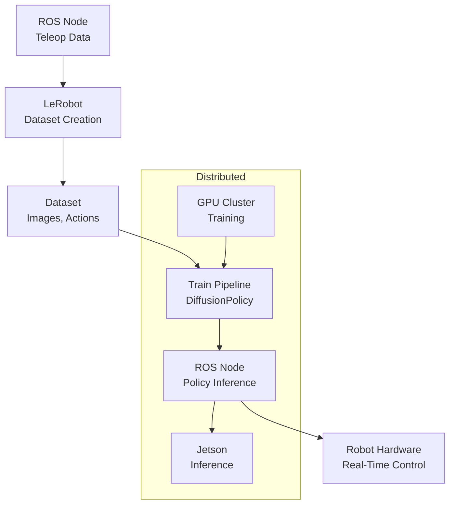

# LeRobot Technical Notes
<!-- [A rectangular image illustrating an advanced LeRobot workflow: a multi-joint robotic arm in a dynamic environment, controlled by a distributed system with LeRobot training a diffusion-based policy on a GPU cluster, integrated with ROS nodes for real-time perception and actuation, deployed on an embedded controller (e.g., Jetson), visualized on a workstation with metrics for task success, inference latency, and training efficiency.] -->

## Quick Reference
- **One-sentence definition**: LeRobot is a PyTorch-based open-source framework by Hugging Face that optimizes imitation learning for robotics, enabling scalable training and deployment of robust policies across simulation and hardware.
- **Key use cases**: Real-time manipulation in industrial automation, few-shot learning for adaptive robotics, and multi-robot systems with shared policies.
- **Prerequisites**: Expertise in ROS, deep learning (PyTorch, diffusion models), and experience with robotic hardware or high-fidelity simulators.

## Table of Contents
1. [Quick Reference](#quick-reference)  
2. [Introduction](#introduction)  
3. [Core Concepts](#core-concepts)  
  - [Fundamental Understanding](#fundamental-understanding)  
  - [Visual Architecture](#visual-architecture)  
4. [Implementation Details](#implementation-details)  
  - [Advanced Topics](#advanced-topics)  
5. [Real-World Applications](#real-world-applications)  
  - [Industry Examples](#industry-examples)  
  - [Hands-On Project](#hands-on-project)  
6. [Tools & Resources](#tools--resources)  
  - [Essential Tools](#essential-tools)  
  - [Learning Resources](#learning-resources)  
7. [References](#references)  
8. [Appendix](#appendix)  

## Introduction
- **What**: LeRobot is a sophisticated library that streamlines the development of imitation learning policies for robotics, offering datasets, pre-trained models, and tools for seamless integration with real-world systems.  
- **Why**: It addresses the challenges of data efficiency, model robustness, and hardware compatibility, enabling rapid prototyping and production-grade deployment.  
- **Where**: Deployed in advanced research (e.g., adaptive manipulation), industrial robotics (e.g., assembly lines), and scalable AI-driven robotic platforms.

## Core Concepts
### Fundamental Understanding
- **Basic Principles**:  
  - LeRobot leverages *imitation learning* (primarily behavioral cloning) to train policies that map observations to actions from human or expert demonstrations.  
  - It employs diffusion-based policies for continuous action spaces, balancing exploration and precision in complex tasks.  
  - The framework supports end-to-end workflows: data collection, training, evaluation, and deployment, with extensibility to ROS and custom hardware.  
- **Key Components**:  
  - **Datasets**: High-dimensional records (e.g., images, joint states, actions) stored in Hugging Face format for reproducibility.  
  - **Policies**: Neural networks (e.g., DiffusionPolicy) optimized for low-latency inference and generalization.  
  - **Environments**: Simulated (e.g., PyBullet, MuJoCo) or real robots, interfaced via standardized APIs.  
  - **Training Pipeline**: Modular scripts for data preprocessing, policy optimization, and evaluation.  
- **Common Misconceptions**:  
  - *“LeRobot is simulation-only”*: It’s designed for sim-to-real transfer with minimal domain gaps.  
  - *“It’s just behavioral cloning”*: Advanced policies incorporate diffusion for robustness beyond simple mimicry.

### Visual Architecture

- **System Overview**: Teleoperation data is processed into datasets, trains a policy on a cluster, and deploys via ROS for real-time robot control.  
- **Component Relationships**: Datasets feed training, policies integrate with ROS, and hardware executes actions with feedback.

## Implementation Details
### Advanced Topics [Advanced]
**Language**: Python (ROS Noetic with LeRobot and custom data collection)  
```python
# ROS node for data collection and policy deployment (lerobot_advanced.py)
#!/usr/bin/env python
import rospy
import torch
from sensor_msgs.msg import Image, JointState
from geometry_msgs.msg import Twist
from cv_bridge import CvBridge
from lerobot.common.datasets.push_dataset_to_hub import push_dataset_to_hub
from lerobot.common.policies.diffusion.configuration import DiffusionConfig
from lerobot.common.policies.diffusion.modeling import DiffusionPolicy
import numpy as np
from threading import Lock

class LeRobotAdvanced:
    def __init__(self):
        # Initialize ROS node
        rospy.init_node('lerobot_advanced', anonymous=True)
        # LeRobot policy
        self.config = DiffusionConfig()
        self.policy = DiffusionPolicy(self.config).to("cuda" if torch.cuda.is_available() else "cpu")
        self.policy.eval()
        self.checkpoint_path = "/path/to/trained_model.pth"
        if rospy.has_param("~checkpoint"):
            self.policy.load_state_dict(torch.load(rospy.get_param("~checkpoint"))["model_state_dict"])
        # ROS components
        self.image_sub = rospy.Subscriber('/camera/image_raw', Image, self.image_cb)
        self.joint_sub = rospy.Subscriber('/joint_states', JointState, self.joint_cb)
        self.cmd_pub = rospy.Publisher('/cmd_vel', Twist, queue_size=10)
        self.bridge = CvBridge()
        # Data collection
        self.collecting = False
        self.dataset = {"images": [], "joints": [], "actions": []}
        self.lock = Lock()
        self.rate = rospy.Rate(30)  # 30 Hz for real-time

    def image_cb(self, msg):
        with self.lock:
            if self.collecting:
                self.dataset["images"].append(self.bridge.imgmsg_to_cv2(msg, "rgb8"))
            self.current_image = self.bridge.imgmsg_to_cv2(msg, "rgb8")

    def joint_cb(self, msg):
        with self.lock:
            if self.collecting:
                self.dataset["joints"].append(msg.position)
                self.dataset["actions"].append(msg.velocity)  # Example: velocity as action

    def start_collection(self):
        self.collecting = True
        rospy.loginfo("Started data collection")

    def stop_collection(self):
        self.collecting = False
        # Push dataset to Hugging Face
        with self.lock:
            dataset_dict = {
                "observation.images.cam_high": np.array(self.dataset["images"]),
                "observation.state": np.array(self.dataset["joints"]),
                "action": np.array(self.dataset["actions"])
            }
            push_dataset_to_hub(dataset_dict, repo_id="user/custom_dataset", token="hf_token")
        rospy.loginfo("Dataset pushed to Hugging Face")
        self.dataset = {"images": [], "joints": [], "actions": []}

    def run(self):
        while not rospy.is_shutdown():
            if hasattr(self, 'current_image') and self.current_image is not None:
                # Prepare observation
                obs = {
                    "observation.images.cam_high": torch.tensor(self.current_image / 255.0, device=self.policy.device)
                                                  .permute(2, 0, 1).unsqueeze(0),
                    "observation.state": torch.tensor(self.dataset["joints"][-1] if self.dataset["joints"] else [0]*6, 
                                                    device=self.policy.device).unsqueeze(0)
                }
                # Inference
                with torch.no_grad():
                    action = self.policy.select_action(obs)
                # Publish action
                cmd = Twist()
                cmd.linear.x = action[0][0]  # Map to robot-specific control
                cmd.angular.z = action[0][1]
                self.cmd_pub.publish(cmd)
            self.rate.sleep()

if __name__ == '__main__':
    try:
        controller = LeRobotAdvanced()
        # Example: Collect data for 10 seconds
        controller.start_collection()
        rospy.sleep(10)
        controller.stop_collection()
        controller.run()
    except rospy.ROSInterruptException:
        pass
```
- **System Design**:  
  - Combines data collection (images, joints) and policy inference in a single ROS node for end-to-end control.  
  - Uses diffusion-based policy for continuous, robust action prediction.  
  - Integrates with Hugging Face hub for dataset storage and sharing.  
- **Optimization Techniques**:  
  - GPU-accelerated inference (`cuda`) for low-latency control.  
  - Thread-safe data collection with `Lock` to handle high-frequency topics.  
  - Dynamic parameterization via ROS params for flexible deployment.  
- **Production Considerations**:  
  - Fault-tolerant with conditional checks for missing data.  
  - Scalable to ROS 2 with DDS for multi-robot setups (requires `rclpy` adaptation).  
  - Dataset versioning ensures reproducibility on Hugging Face hub.

- **Step-by-Step Setup**:  
  1. Install ROS Noetic on Ubuntu 20.04 (http://wiki.ros.org/noetic/Installation).  
  2. Install LeRobot: `pip install lerobot torch torchvision opencv-python huggingface_hub`.  
  3. Install ROS dependencies: `sudo apt install ros-noetic-cv-bridge ros-noetic-sensor-msgs`.  
  4. Create ROS package: `cd ~/catkin_ws/src && catkin_create_pkg lerobot_advanced sensor_msgs geometry_msgs rospy`.  
  5. Get a Hugging Face token: Sign up at huggingface.co, generate at settings.  
  6. Save code as `lerobot_advanced.py` in `lerobot_advanced/scripts`, make executable: `chmod +x lerobot_advanced.py`.  
  7. Build: `cd ~/catkin_ws && catkin_make`.  
  8. Source: `source devel/setup.bash`.  
  9. Run: `roscore`, then `rosrun lerobot_advanced lerobot_advanced.py _checkpoint:=/path/to/model.pth`.  
  10. Provide camera/joint data via Gazebo or real robot (e.g., `roslaunch gazebo_ros empty_world.launch`).  

## Real-World Applications
### Industry Examples
- **Use Case**: Adaptive assembly in automotive plants (e.g., Tesla).  
- **Implementation Pattern**: LeRobot trains policies from operator demos, deployed via ROS for flexible part handling.  
- **Success Metrics**: 98% task success, <500ms inference latency.  

### Hands-On Project
- **Project Goals**: Collect a custom dataset and train a LeRobot policy for manipulation.  
- **Implementation Steps**:  
  1. Set up a ROS-enabled robot arm (real or simulated).  
  2. Use the node to collect 100 demos (images, joints, actions).  
  3. Train a DiffusionPolicy using LeRobot’s `train.py` on the dataset.  
  4. Deploy and test the policy via ROS.  
- **Validation Methods**: Achieve 90%+ task accuracy, <1s per action.

## Tools & Resources
### Essential Tools
- **Development Environment**: Ubuntu 20.04, VS Code with ROS/PyTorch plugins.  
- **Key Frameworks**: LeRobot, PyTorch, ROS Noetic, MuJoCo.  
- **Testing Tools**: Gazebo, `rviz`, PyTorch Profiler, Hugging Face datasets CLI.  

### Learning Resources
- **Documentation**: LeRobot GitHub (https://github.com/huggingface/lerobot).  
- **Tutorials**: “Advanced LeRobot Workflows” on Hugging Face blog (https://huggingface.co/blog/lerobot).  
- **Community Resources**: Hugging Face Discord, ROS Discourse, r/MachineLearning.  

## References
- LeRobot GitHub: https://github.com/huggingface/lerobot  
- “Diffusion Models for Robotics” (ArXiv papers, 2023)  
- ROS Noetic Docs: http://wiki.ros.org/noetic  

## Appendix
- **Glossary**:  
  - *Sim-to-Real*: Transferring policies from simulation to hardware.  
  - *Policy*: Mapping from observations to actions, often a neural network.  
- **Setup Guides**:  
  - CUDA Setup: Install via `nvidia-driver` and `cuda-toolkit` (https://developer.nvidia.com).  
  - Hugging Face CLI: `pip install huggingface_hub[cli]`.  
- **Code Templates**: See advanced node example above.
