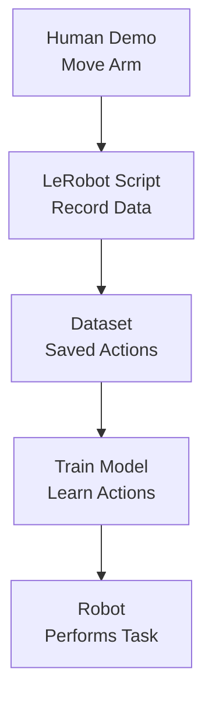

# LeRobot Technical Notes
<!-- [A rectangular image showing a simplified LeRobot workflow: a beginner-friendly diagram with a small robotic arm, a laptop running Python code, and arrows showing data collection (e.g., human moving the arm) and AI training, displayed on a screen with icons for ease-of-use and learning.] -->

## Quick Reference
- **One-sentence definition**: LeRobot is an open-source Python library by Hugging Face that simplifies training AI models for real-world robotics using imitation learning and datasets.
- **Key use cases**: Teaching robots to perform tasks like picking objects or moving arms with minimal data, especially for beginners and researchers.
- **Prerequisites**: Basic Python (e.g., running scripts), a computer (Linux/Mac/Windows), and optional access to a simple robot or simulator.

## Table of Contents
1. [Quick Reference](#quick-reference)  
2. [Introduction](#introduction)  
3. [Core Concepts](#core-concepts)  
    - [Fundamental Understanding](#fundamental-understanding)  
    - [Visual Architecture](#visual-architecture)  
4. [Implementation Details](#implementation-details)  
    - [Basic Implementation [Beginner]](#basic-implementation-beginner)  
5. [Real-World Applications](#real-world-applications)  
    - [Industry Examples](#industry-examples)  
    - [Hands-On Project](#hands-on-project)  
6. [Tools & Resources](#tools--resources)  
    - [Essential Tools](#essential-tools)  
    - [Learning Resources](#learning-resources)  
7. [References](#references)  
8. [Appendix](#appendix)   

## Introduction
- **What**: LeRobot is a PyTorch-based library that provides tools, datasets, and pre-trained models to help anyone train AI for robots to mimic human actions.  
- **Why**: It lowers the barrier to robotics by making it easier to collect data and train models without needing expensive hardware or deep expertise.  
- **Where**: Used in education (e.g., learning robotics), research (e.g., testing new algorithms), and hobby projects (e.g., DIY robot arms).

## Core Concepts
### Fundamental Understanding
- **Basic Principles**:  
  - LeRobot focuses on *imitation learning*, where a robot learns by copying human demonstrations (e.g., you move an arm, it copies).  
  - It uses datasets of actions (e.g., arm movements) to train AI models that control robots.  
  - The library is designed to be user-friendly, with scripts to collect data and train models in Python.  
- **Key Components**:  
  - **Datasets**: Collections of human-recorded actions (e.g., videos of moving a robot arm) stored in a special format.  
  - **Models**: AI algorithms (e.g., neural networks) that learn from datasets to control robots.  
  - **Scripts**: Ready-to-use Python code for tasks like recording data or training models.  
- **Common Misconceptions**:  
  - *“I need a robot to start”*: LeRobot includes simulators, so you can learn without hardware.  
  - *“It’s only for experts”*: It’s built for beginners with clear tutorials and examples.  

### Visual Architecture

- **System Overview**: A human demonstrates a task, LeRobot records it as a dataset, trains a model, and the robot uses the model to act.  
- **Component Relationships**: Data collection feeds training, which produces a model for robot control.

## Implementation Details
### Basic Implementation [Beginner]
**Language**: Python (using LeRobot’s PushT simulator)  
```py
# Simple example to visualize a LeRobot dataset (pusht_dataset.py)
import lerobot
from lerobot.common.datasets.lerobot_dataset import LeRobotDataset
import torch

# Load a pre-existing PushT dataset (simulated block-pushing)
dataset = LeRobotDataset("lerobot/pusht")

# Access one episode (a sequence of actions)
episode = dataset[0]

# Print some data (e.g., robot state)
print("Robot state at step 0:", episode["observation.state"][0])

# Visualize the dataset (shows a video of the task)
dataset.visualize_episodes(num_episodes=1)
```
- **Step-by-Step Setup**:  
  1. Install Python 3.8+ (python.org).  
  2. Install LeRobot: `pip install lerobot` (Linux/Mac; Windows may need WSL).  
  3. Save code as `pusht_dataset.py`.  
  4. Run: `python pusht_dataset.py`.  
  5. Expect a window showing a simulated arm pushing a block.  
- **Code Walkthrough**:  
  - `LeRobotDataset` loads a sample dataset (`pusht`) from Hugging Face.  
  - `episode` contains actions and states (e.g., arm positions).  
  - `visualize_episodes` displays the task as a video to understand the data.  
- **Common Pitfalls**:  
  - Missing dependencies: Ensure PyTorch is installed (`pip install torch`).  
  - Wrong dataset name: Use exact repo ID (`lerobot/pusht`).  
  - GPU not required but can speed up visualization if available.

## Real-World Applications
### Industry Examples
- **Use Case**: Teaching a robot arm to pick up objects in a lab.  
- **Implementation Pattern**: Record a human moving the arm, use LeRobot to train a model, and deploy it.  
- **Success Metrics**: Robot picks items correctly with 80%+ success after 10 demos.  

### Hands-On Project
- **Project Goals**: Explore LeRobot’s PushT dataset to understand robot actions.  
- **Implementation Steps**:  
  1. Install LeRobot and run the example code above.  
  2. Visualize 2 episodes to see how the arm pushes the block.  
  3. Print different data fields (e.g., `observation.images.cam_high`) to learn the dataset structure.  
- **Validation Methods**: Confirm the visualization runs and displays a clear task sequence.

## Tools & Resources
### Essential Tools
- **Development Environment**: VS Code, Jupyter Notebook.  
- **Key Frameworks**: LeRobot, PyTorch, Hugging Face datasets.  
- **Testing Tools**: Matplotlib (included with LeRobot for visuals).  

### Learning Resources
- **Documentation**: LeRobot GitHub (https://github.com/huggingface/lerobot).  
- **Tutorials**: “Getting Started with LeRobot” on Hugging Face YouTube (https://www.youtube.com/@HuggingFace).  
- **Community Resources**: Hugging Face Discord, r/robotics on Reddit.  

## References
- LeRobot GitHub: https://github.com/huggingface/lerobot  
- Hugging Face LeRobot Page: https://huggingface.co/lerobot  
- “Introduction to Robot Learning” (online articles)  

## Appendix
- **Glossary**:  
  - *Imitation Learning*: Teaching a model by copying human actions.  
  - *Dataset*: Recorded actions and states for training.  
- **Setup Guides**:  
  - Python setup: Install via python.org or Anaconda.  
  - LeRobot troubleshooting: Check GitHub issues for pip errors.  
- **Code Templates**: See dataset visualization example above.
