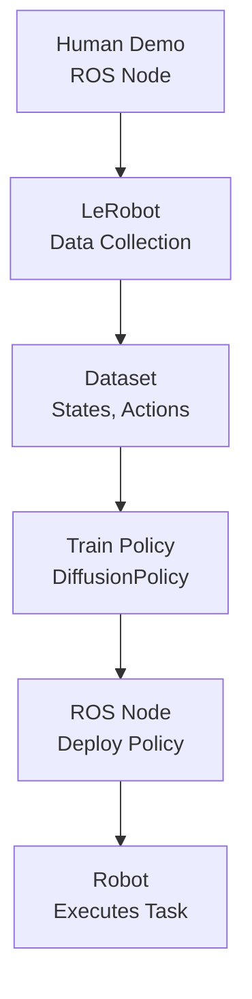

# LeRobot Technical Notes
<!-- [A rectangular image depicting an intermediate LeRobot workflow: a programmer collecting data with a robotic arm (e.g., moving objects), feeding it into a LeRobot script for training a neural network, integrated with a ROS node for real-time control, visualized on a laptop with metrics for training accuracy, inference speed, and task success rate.] -->

## Quick Reference
- **One-sentence definition**: LeRobot is a PyTorch-based open-source library by Hugging Face that streamlines imitation learning for robotics, enabling efficient training and deployment of AI models for tasks like manipulation.
- **Key use cases**: Developing robust policies for robot arms, integrating with simulators or real hardware, and prototyping learning-based control systems.
- **Prerequisites**: Proficiency in Python, basic ML experience (e.g., PyTorch, datasets), and familiarity with ROS or robotics frameworks.

## Table of Contents
1. [Quick Reference](#quick-reference)  
2. [Introduction](#introduction)  
3. [Core Concepts](#core-concepts)  
  - [Fundamental Understanding](#fundamental-understanding)  
  - [Visual Architecture](#visual-architecture)  
4. [Implementation Details](#implementation-details)  
  - [Intermediate Patterns](#intermediate-patterns-intermediate)  
5. [Real-World Applications](#real-world-applications)  
  - [Industry Examples](#industry-examples)  
  - [Hands-On Project](#hands-on-project)  
6. [Tools & Resources](#tools--resources)  
  - [Essential Tools](#essential-tools)  
  - [Learning Resources](#learning-resources)  
7. [References](#references)  
8. [Appendix](#appendix)  

## Introduction
- **What**: LeRobot provides a unified framework for collecting datasets, training imitation learning models, and deploying them on robots, with support for both simulation and hardware.  
- **Why**: It simplifies the complexity of robotics AI by offering pre-built datasets, models, and integration tools, enabling faster iteration and reliable performance.  
- **Where**: Applied in research labs (e.g., learning manipulation), education (e.g., robotics courses), and industry prototypes (e.g., pick-and-place systems).

## Core Concepts
### Fundamental Understanding
- **Basic Principles**:  
  - LeRobot centers on *behavioral cloning* (a type of imitation learning), where models learn to mimic human demonstrations encoded in datasets.  
  - It supports modular workflows: data collection, model training, and policy evaluation, with seamless simulator-to-hardware transitions.  
  - Integration with frameworks like ROS enhances real-world deployment.  
- **Key Components**:  
  - **Datasets**: Structured records of states, actions, and observations (e.g., arm positions, camera images).  
  - **Policies**: Neural networks mapping observations to actions (e.g., DiffusionPolicy for continuous control).  
  - **Environment**: Simulated (e.g., PyBullet) or real robots for training and testing.  
- **Common Misconceptions**:  
  - *“LeRobot requires real robots”*: Simulators like PushT allow experimentation without hardware.  
  - *“It’s just ML”*: It bridges ML with robotics, requiring careful environment and control integration.

### Visual Architecture

- **System Overview**: Demonstrations are recorded via ROS, processed into datasets, used to train policies, and deployed back to robots via ROS.  
- **Component Relationships**: Data drives training, policies enable control, and ROS ensures seamless integration.

## Implementation Details
### Intermediate Patterns [Intermediate]
**Language**: Python (using LeRobot with ROS Noetic integration)  
```py
# ROS node to collect data and deploy a LeRobot policy (lerobot_controller.py)
#!/usr/bin/env python
import rospy
import torch
from sensor_msgs.msg import Image
from geometry_msgs.msg import Twist
from lerobot.common.policies.diffusion.configuration import DiffusionConfig
from lerobot.common.policies.diffusion.modeling import DiffusionPolicy
from cv_bridge import CvBridge
import numpy as np

class LeRobotController:
    def __init__(self):
        # Initialize ROS node
        rospy.init_node('lerobot_controller', anonymous=True)
        # LeRobot policy (pre-trained PushT)
        self.config = DiffusionConfig()
        self.policy = DiffusionPolicy(self.config)
        checkpoint = torch.load("/path/to/pusht_model.pth", map_location="cpu")
        self.policy.load_state_dict(checkpoint["model_state_dict"])
        self.policy.eval()
        # ROS components
        self.image_sub = rospy.Subscriber('/camera/image_raw', Image, self.image_cb)
        self.cmd_pub = rospy.Publisher('/cmd_vel', Twist, queue_size=10)
        self.bridge = CvBridge()
        self.current_image = None

    def image_cb(self, msg):
        # Convert ROS image to numpy
        self.current_image = self.bridge.imgmsg_to_cv2(msg, "rgb8")

    def run(self):
        rate = rospy.Rate(10)  # 10 Hz
        while not rospy.is_shutdown():
            if self.current_image is not None:
                # Prepare observation
                obs = {"observation.images.cam_high": torch.tensor(self.current_image / 255.0).permute(2, 0, 1).unsqueeze(0)}
                # Get action from policy
                with torch.no_grad():
                    action = self.policy.select_action(obs)
                # Convert to ROS Twist message
                cmd = Twist()
                cmd.linear.x = action[0][0]  # Example mapping
                cmd.angular.z = action[0][1]
                self.cmd_pub.publish(cmd)
                rospy.loginfo(f"Action: {action}")
            rate.sleep()

if __name__ == '__main__':
    try:
        controller = LeRobotController()
        controller.run()
    except rospy.ROSInterruptException:
        pass
```
- **Design Patterns**:  
  - **Policy Integration**: Loads a pre-trained DiffusionPolicy for real-time control via ROS.  
  - **ROS Bridge**: Converts camera images to LeRobot-compatible tensors for inference.  
- **Best Practices**:  
  - Normalize inputs (e.g., images to 0-1) to match training conditions.  
  - Use `rospy.Rate` for consistent control loops.  
  - Save checkpoints to avoid retraining (`torch.load`).  
- **Performance Considerations**:  
  - Run inference on CPU for simplicity or GPU for speed (`map_location`).  
  - Optimize topic frequency (10 Hz) to balance latency and bandwidth.  

- **Step-by-Step Setup**:  
  1. Install ROS Noetic on Ubuntu 20.04 (http://wiki.ros.org/noetic/Installation).  
  2. Install LeRobot: `pip install lerobot torch opencv-python`.  
  3. Install ROS dependencies: `sudo apt install python-rospy ros-noetic-cv-bridge`.  
  4. Create a ROS package: `cd ~/catkin_ws/src && catkin_create_pkg lerobot_control sensor_msgs geometry_msgs rospy`.  
  5. Download a pre-trained PushT model (e.g., from LeRobot GitHub or train via `train.py`).  
  6. Save code as `lerobot_controller.py` in `lerobot_control/scripts`, make executable: `chmod +x lerobot_controller.py`.  
  7. Build: `cd ~/catkin_ws && catkin_make`.  
  8. Source: `source devel/setup.bash`.  
  9. Run: `roscore`, then `rosrun lerobot_control lerobot_controller.py`.  
  10. Simulate camera: Use a ROS camera node or Gazebo (`roslaunch gazebo_ros empty_world.launch`).  

## Real-World Applications
### Industry Examples
- **Use Case**: Robotic pick-and-place in manufacturing.  
- **Implementation Pattern**: LeRobot trains a policy from human demos, deployed via ROS for conveyor tasks.  
- **Success Metrics**: 95%+ success rate with <1s per pick.  

### Hands-On Project
- **Project Goals**: Train and deploy a LeRobot policy for PushT in simulation.  
- **Implementation Steps**:  
  1. Install LeRobot and PyBullet (`pip install pybullet`).  
  2. Train a DiffusionPolicy on `lerobot/pusht` using LeRobot’s `train.py`.  
  3. Integrate the policy in a ROS node to control a simulated arm.  
  4. Test block-pushing accuracy.  
- **Validation Methods**: Achieve 90%+ task completion in simulation.

## Tools & Resources
### Essential Tools
- **Development Environment**: VS Code, Ubuntu 20.04.  
- **Key Frameworks**: LeRobot, PyTorch, ROS Noetic, PyBullet.  
- **Testing Tools**: Gazebo, `rviz`, `rostopic` for debugging.  

### Learning Resources
- **Documentation**: LeRobot GitHub (https://github.com/huggingface/lerobot).  
- **Tutorials**: “LeRobot Training Guide” on Hugging Face blog (https://huggingface.co/blog/lerobot).  
- **Community Resources**: Hugging Face Forums, ROS Answers (https://answers.ros.org).  

## References
- LeRobot GitHub: https://github.com/huggingface/lerobot  
- ROS Wiki: http://wiki.ros.org  
- “Imitation Learning for Robotics” (Hussein et al., 2017)  

## Appendix
- **Glossary**:  
  - *Behavioral Cloning*: Learning actions from demonstrations.  
  - *DiffusionPolicy*: Neural network for continuous action spaces.  
- **Setup Guides**:  
  - PyTorch GPU: `pip install torch --index-url https://download.pytorch.org/whl/cu118`.  
- **Code Templates**: See ROS integration example above.
