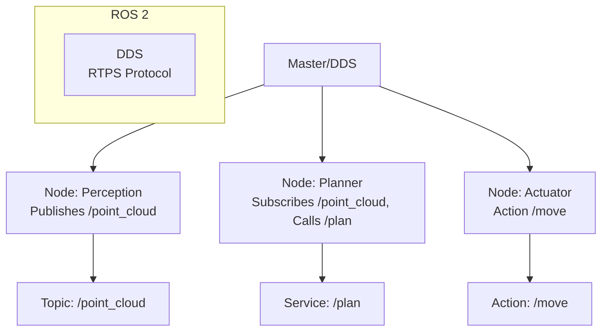

# ROS Technical Notes
<!-- [A rectangular image illustrating an advanced ROS workflow: a distributed system with multiple nodes (e.g., perception, planning, actuation) running across a robot and a cloud server, communicating via topics, services, and actions, managed by a Master or DDS (ROS 2), visualized in a Gazebo simulation with real-time metrics for latency, bandwidth, and fault tolerance.] -->

## Quick Reference
- **One-sentence definition**: ROS (Robot Operating System) is a scalable, distributed middleware framework that orchestrates modular robotic systems through robust communication and integration mechanisms.
- **Key use cases**: Developing production-ready autonomous systems, real-time sensor fusion, and complex multi-robot coordination.
- **Prerequisites**: Proficiency in ROS 1/2, Python/C++, Linux systems, and experience with robotic hardware or simulation.

## Table of Contents
- [Introduction](#introduction)
- [Core Concepts](#core-concepts)
  - [Fundamental Understanding](#fundamental-understanding)
  - [Visual Architecture](#visual-architecture)
- [Implementation Details](#implementation-details)
  - [Advanced Topics](#advanced-topics)
- [Real-World Applications](#real-world-applications)
  - [Industry Examples](#industry-examples)
  - [Hands-On Project](#hands-on-project)
- [Tools & Resources](#tools--resources)
  - [Essential Tools](#essential-tools)
  - [Learning Resources](#learning-resources)
- [References](#references)
- [Appendix](#appendix)

## Introduction
- **What**: ROS is a sophisticated framework that provides a distributed architecture for robotics, enabling seamless communication, modularity, and integration across heterogeneous hardware and software components.  
- **Why**: It streamlines the development of complex, reliable robotic systems by abstracting low-level details, ensuring scalability, and supporting rapid prototyping-to-production workflows.  
- **Where**: Deployed in self-driving cars (e.g., Apollo), industrial automation (e.g., ROS-Industrial), and multi-robot research (e.g., swarm systems).

## Core Concepts
### Fundamental Understanding
- **Basic Principles**:  
  - ROS operates on a peer-to-peer network of nodes, orchestrated via a centralized Master (ROS 1) or decentralized DDS (ROS 2), ensuring flexible communication.  
  - It supports multiple paradigms: publish-subscribe (topics), request-response (services), and goal-oriented (actions) for diverse use cases.  
  - Fault tolerance and scalability are achieved through modularity, parameterization, and dynamic reconfiguration.  
- **Key Components**:  
  - **Nodes**: Independent processes handling specific functions (e.g., SLAM, control), often containerized in production.  
  - **Communication Primitives**: Topics (async), services (sync), actions (async with feedback), and parameters (dynamic configs).  
  - **Launch System**: XML-based scripts (`roslaunch`) for orchestrating multiple nodes and settings.  
  - **Messages/Services**: Custom or standard types (e.g., `nav_msgs/Path`) ensuring interoperability.  
- **Common Misconceptions**:  
  - *“ROS 1 is outdated”*: It remains robust for many applications; ROS 2 adds real-time and security features.  
  - *“Communication is always lightweight”*: High-frequency topics (e.g., point clouds) require bandwidth optimization.

### Visual Architecture

- **System Overview**: Nodes communicate via topics, services, or actions, coordinated by a Master (ROS 1) or DDS (ROS 2) for distributed operation.  
- **Component Relationships**: Topics stream data, services handle queries, actions manage tasks, and the Master/DDS ensures discovery.

## Implementation Details
### Advanced Topics [Advanced]
**Language**: Python (ROS Noetic)  
```python
# Advanced node with action server, dynamic reconfigure, and launch (robot_nav.py)
#!/usr/bin/env python
import rospy
import actionlib
from nav_msgs.msg import Path
from geometry_msgs.msg import Twist
from dynamic_reconfigure.server import Server
from robot_nav.cfg import NavConfig
from std_msgs.msg import Float32
from actionlib_msgs.msg import GoalStatus

class NavActionServer:
    def __init__(self):
        # Initialize node
        rospy.init_node('nav_server', anonymous=True)
        # Action server
        self.action_server = actionlib.SimpleActionServer(
            '/navigate', PathAction, execute_cb=self.execute_nav, auto_start=False
        )
        self.action_server.start()
        # Publisher for control
        self.cmd_pub = rospy.Publisher('/cmd_vel', Twist, queue_size=10)
        # Subscriber for sensor
        self.sensor_sub = rospy.Subscriber('/distance', Float32, self.sensor_cb)
        # Dynamic reconfigure
        self.dyn_srv = Server(NavConfig, self.dyn_reconfigure_cb)
        self.speed = 0.1  # Default from config
        self.distance = 0.0

    def sensor_cb(self, msg):
        self.distance = msg.data

    def dyn_reconfigure_cb(self, config, level):
        self.speed = config.speed
        rospy.loginfo(f"Updated speed to {self.speed}")
        return config

    def execute_nav(self, goal):
        # Action execution
        path = goal.path
        success = True
        for _ in range(len(path.poses)):
            if self.distance < 0.5:  # Obstacle detected
                self.action_server.set_aborted(text="Obstacle detected")
                success = False
                break
            vel = Twist()
            vel.linear.x = self.speed
            self.cmd_pub.publish(vel)
            rospy.sleep(1.0)  # Simulate movement
        if success:
            self.action_server.set_succeeded()

if __name__ == '__main__':
    try:
        NavActionServer()
        rospy.spin()
    except rospy.ROSInterruptException:
        pass
```
**Launch File** (`nav.launch`):
```xml
<launch>
    <node pkg="robot_nav" type="robot_nav.py" name="nav_server" output="screen"/>
    <param name="speed" value="0.2"/>
    <include file="$(find robot_nav)/config/dynamic_reconfigure.launch"/>
</launch>
```
- **System Design**:  
  - Implements an action server for goal-oriented navigation, integrating topics and dynamic reconfiguration.  
  - Uses `roslaunch` for system orchestration and parameterization.  
- **Optimization Techniques**:  
  - Action feedback enables progress monitoring, critical for long-running tasks.  
  - Dynamic reconfigure allows runtime tuning without restarting nodes.  
- **Production Considerations**:  
  - Fault tolerance via action preemption/abortion for obstacle handling.  
  - Bandwidth-efficient messaging with appropriate `queue_size`.  
  - ROS 2 alternative would use DDS for real-time guarantees (not shown).

- **Step-by-Step Setup**:  
  1. Ensure ROS Noetic on Ubuntu 20.04 (http://wiki.ros.org/noetic/Installation).  
  2. Workspace: `cd ~/catkin_ws/src && catkin_create_pkg robot_nav nav_msgs geometry_msgs std_msgs actionlib_msgs dynamic_reconfigure`.  
  3. Generate action: Create `Path.action` in `robot_nav/action` (Goal: `nav_msgs/Path path`, Result/Feedback empty).  
  4. Save `robot_nav.py` in `scripts`, `nav.launch` in `launch`, and config in `cfg`.  
  5. Build: `cd ~/catkin_ws && catkin_make`.  
  6. Source: `source devel/setup.bash`.  
  7. Run: `roslaunch robot_nav nav.launch`.  
  8. Test action: Use `rostopic pub` or action client to send goals.  

## Real-World Applications
### Industry Examples
- **Use Case**: Multi-robot warehouse automation (Amazon Robotics).  
- **Implementation Pattern**: ROS nodes for SLAM, fleet management, and task allocation via actions/topics.  
- **Success Metrics**: 99% uptime, <200ms latency per node.  

### Hands-On Project
- **Project Goals**: Build a navigation action server for a simulated robot.  
- **Implementation Steps**:  
  1. Set up Gazebo: `sudo apt install ros-noetic-gazebo-ros`.  
  2. Create an action server node subscribing to `/scan` (lidar), publishing `/cmd_vel`.  
  3. Add dynamic reconfigure for speed tuning.  
  4. Test in Gazebo with a TurtleBot3 model.  
- **Validation Methods**: Achieve obstacle avoidance; verify action completion.

## Tools & Resources
### Essential Tools
- **Development Environment**: Ubuntu 20.04, VS Code with ROS plugin.  
- **Key Frameworks**: ROS Noetic, rospy/roslibpy, MoveIt, Navigation Stack.  
- **Testing Tools**: `rviz`, `rqt`, Gazebo, `rosbag` for logging.  

### Learning Resources
- **Documentation**: ROS Wiki (http://wiki.ros.org).  
- **Tutorials**: “Advanced ROS” on The Construct (https://www.theconstruct.ai).  
- **Community Resources**: ROS Discourse, ROS-Industrial forums.  

## References
- ROS Wiki: http://wiki.ros.org  
- “Programming Robots with ROS” (Quigley et al., 2015)  
- ROS 2 Docs: https://docs.ros.org  

## Appendix
- **Glossary**:  
  - *Action*: Goal-oriented communication with feedback.  
  - *Dynamic Reconfigure*: Runtime parameter tuning.  
- **Setup Guides**:  
  - Gazebo Setup: `sudo apt install ros-noetic-gazebo-ros-pkgs`.  
- **Code Templates**: See action server above.
