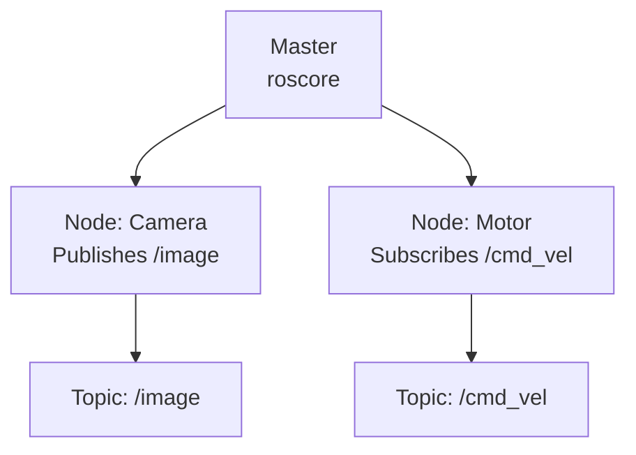

# ROS Technical Notes
<!-- [A rectangular image showing a simplified ROS workflow: a beginner-friendly diagram with a robot (e.g., a small wheeled bot), arrows connecting labeled boxes for “Nodes” (e.g., camera, motor control), a “Master” hub, and lines labeled “Topics” showing data flow, displayed on a laptop screen with icons for modularity and communication.] -->

## Quick Reference
- **One-sentence definition**: ROS (Robot Operating System) is a flexible framework for building robot software, providing tools and libraries to manage communication and computation across modular components.
- **Key use cases**: Controlling robots, simulating robotic behavior, and integrating sensors for tasks like navigation or object detection.
- **Prerequisites**: Basic familiarity with Linux commands (e.g., using a terminal), Python or C++ knowledge helpful but not required, and a computer with Ubuntu.

## Table of Contents
- [Introduction](#introduction)
- [Core Concepts](#core-concepts)
  - [Fundamental Understanding](#fundamental-understanding)
  - [Visual Architecture](#visual-architecture)
- [Implementation Details](#implementation-details)
  - [Basic Implementation](#basic-implementation)
- [Real-World Applications](#real-world-applications)
  - [Industry Examples](#industry-examples)
  - [Hands-On Project](#hands-on-project)
- [Tools & Resources](#tools--resources)
  - [Essential Tools](#essential-tools)
  - [Learning Resources](#learning-resources)
- [References](#references)
- [Appendix](#appendix)

## Introduction
- **What**: ROS is not a true operating system but a middleware framework that helps developers create robot applications by managing communication between different parts of a system.  
- **Why**: It simplifies building complex robots by providing reusable code, tools for visualization, and a way to break tasks into manageable pieces, avoiding the need to start from scratch.  
- **Where**: Used in research (e.g., university labs), industry (e.g., self-driving cars), and hobby projects (e.g., DIY robot arms).[](https://husarion.com/tutorials/ros-tutorials/1-ros-introduction/)

## Core Concepts
### Fundamental Understanding
- **Basic Principles**:  
  - ROS breaks a robot’s software into small, independent programs that work together.  
  - It uses a communication system to share data, like sensor readings or commands, between these programs.  
  - Everything runs on a Linux-based system, often Ubuntu, for flexibility and open-source support.  
- **Key Components**:  
  - **Nodes**: Individual programs that perform specific tasks (e.g., reading a camera, controlling wheels).  
  - **Topics**: Named channels where nodes send and receive data (e.g., “camera/image” for pictures).  
  - **Master**: A central service (started with `roscore`) that helps nodes find each other.  [](https://robodev.blog/ros-basic-concepts)[](http://wiki.ros.org/ROS/Tutorials/UnderstandingNodes)
- **Common Misconceptions**:  
  - *“ROS is an OS like Windows”*: It’s a framework that runs on Linux, not a standalone OS.  
  - *“It’s only for experts”*: Beginners can start with simple tools and tutorials.  

### Visual Architecture

- **System Overview**: The Master connects nodes, which communicate by publishing or subscribing to topics.  
- **Component Relationships**: Nodes send data via topics (publish/subscribe), and the Master ensures they can find each other.[](http://wiki.ros.org/ROS/Tutorials/UnderstandingNodes)

## Implementation Details
### Basic Implementation [Beginner]
**Language**: Python (using ROS Noetic)  
```python
# Publisher node (talker.py) to send a message
#!/usr/bin/env python
import rospy
from std_msgs.msg import String

def talker():
    # Initialize node
    rospy.init_node('talker', anonymous=True)
    # Create publisher for topic 'chatter'
    pub = rospy.Publisher('chatter', String, queue_size=10)
    rate = rospy.Rate(1)  # 1 Hz
    while not rospy.is_shutdown():
        msg = "Hello, ROS!"
        pub.publish(msg)
        rospy.loginfo(msg)
        rate.sleep()

if __name__ == '__main__':
    try:
        talker()
    except rospy.ROSInterruptException:
        pass
```
```python
# Subscriber node (listener.py) to receive the message
#!/usr/bin/env python
import rospy
from std_msgs.msg import String

def callback(data):
    rospy.loginfo("I heard: %s", data.data)

def listener():
    # Initialize node
    rospy.init_node('listener', anonymous=True)
    # Subscribe to topic 'chatter'
    rospy.Subscriber('chatter', String, callback)
    # Keep node running
    rospy.spin()

if __name__ == '__main__':
    listener()
```
- **Step-by-Step Setup**:  
  1. Install ROS Noetic on Ubuntu 20.04: Follow http://wiki.ros.org/noetic/Installation/Ubuntu.  
  2. Create a workspace: `mkdir -p ~/catkin_ws/src && cd ~/catkin_ws && catkin_make`.  
  3. Create a package: `cd src && catkin_create_pkg beginner_tutorials std_msgs rospy`.  
  4. Save `talker.py` and `listener.py` in `beginner_tutorials/scripts`, make executable: `chmod +x *.py`.  
  5. Build: `cd ~/catkin_ws && catkin_make`.  
  6. Source: `source devel/setup.bash`.  
  7. Run Master: `roscore`.  
  8. Run talker in new terminal: `rosrun beginner_tutorials talker.py`.  
  9. Run listener in another: `rosrun beginner_tutorials listener.py`.  
- **Code Walkthrough**:  
  - `talker.py` creates a node that publishes “Hello, ROS!” to the `chatter` topic every second.  
  - `listener.py` creates another's node that listens to `chatter` and prints the message.  
  - `rospy` is the Python ROS library; `std_msgs.msg.String` defines the message type.  
- **Common Pitfalls**:  
  - Forgetting `roscore`—it must run first.  
  - Not sourcing the workspace: `source devel/setup.bash` after every build.  
  - Wrong file permissions: Ensure scripts are executable.[](https://www.rosroboticslearning.com/basics-of-ros)[](https://clearpathrobotics.com/blog/2014/09/ros-101-creating-node/)

## Real-World Applications
### Industry Examples
- **Use Case**: A warehouse robot navigating shelves.  
- **Implementation Pattern**: ROS nodes handle sensors (e.g., lidar) and motion planning, communicating via topics.  
- **Success Metrics**: Reliable navigation with minimal collisions.  

### Hands-On Project
- **Project Goals**: Control a virtual turtle in TurtleSim to move in a square.  
- **Implementation Steps**:  
  1. Install TurtleSim: `sudo apt install ros-noetic-turtlesim`.  
  2. Run: `rosrun turtlesim turtlesim_node`.  
  3. Create a Python node to publish velocity commands to `/turtle1/cmd_vel`.  
  4. Test by watching the turtle draw a square.  
- **Validation Methods**: Confirm the turtle completes a square path visually.[](https://bootcampai.medium.com/top-10-beginner-friendly-ros-projects-df7b92050257)

## Tools & Resources
### Essential Tools
- **Development Environment**: Ubuntu 20.04, VS Code, or terminal.  
- **Key Frameworks**: ROS Noetic, Python (rospy), catkin build system.  
- **Testing Tools**: `rviz` (visualization), `rostopic` (debug topics).  

### Learning Resources
- **Documentation**: ROS Wiki (http://wiki.ros.org/ROS/Tutorials).  
- **Tutorials**: “ROS for Beginners” on The Construct (https://www.theconstruct.ai).  
- **Community Resources**: ROS Answers (https://answers.ros.org), r/ROS on Reddit.[](https://www.theconstruct.ai/ros-for-beginners-how-to-learn-ros/)

## References
- ROS Wiki Tutorials: http://wiki.ros.org/ROS/Tutorials[](https://www.rosroboticslearning.com/basics-of-ros)
- “Programming Robots with ROS” (Quigley et al., 2015)  
- The Construct ROS Tutorials: https://www.theconstruct.ai[](https://www.theconstruct.ai/category/ros-tutorials/)

## Appendix
- **Glossary**:  
  - *Node*: A program doing one job (e.g., reading a sensor).  
  - *Topic*: A named channel for data (e.g., sensor readings).  
- **Setup Guides**:  
  - Install Ubuntu 20.04: Download from ubuntu.com.  
  - ROS Noetic Install: http://wiki.ros.org/noetic/Installation/Ubuntu.  
- **Code Templates**: See publisher/subscriber example above.
