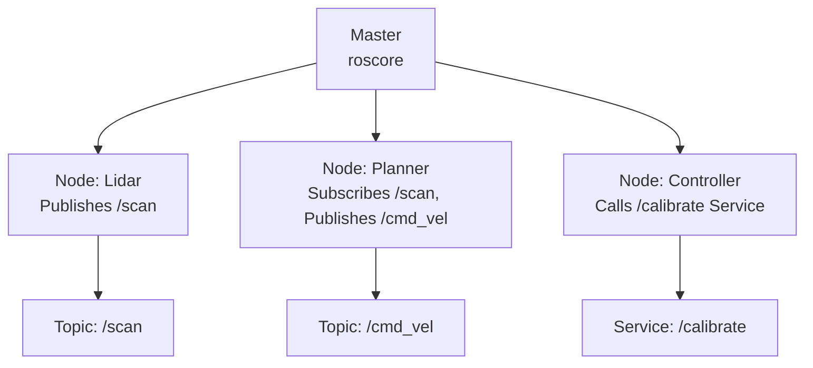

# ROS Technical Notes
<!-- [A rectangular image depicting an intermediate ROS workflow: a programmer managing a robot system with multiple nodes (e.g., sensor processing, path planning, motor control), interconnected via topics and services, coordinated by a Master, running on a simulated robot in Gazebo, displayed on a screen with metrics for communication latency and system modularity.] -->

## Quick Reference
- **One-sentence definition**: ROS (Robot Operating System) is a modular framework that streamlines robot software development by enabling efficient communication and integration of distributed components.
- **Key use cases**: Building complex robotic systems for navigation, manipulation, and sensor fusion in real or simulated environments.
- **Prerequisites**: Familiarity with ROS basics (nodes, topics, `roscore`), proficiency in Python or C++, and comfort with Linux (Ubuntu).

## Table of Contents
## Table of Contents
1. [Introduction](#introduction)  
2. [Core Concepts](#core-concepts)  
  - [Fundamental Understanding](#fundamental-understanding)  
  - [Visual Architecture](#visual-architecture)  
3. [Implementation Details](#implementation-details)  
  - [Basic Implementation](#basic-implementation)  
  - [Intermediate Patterns](#intermediate-patterns)  
4. [Real-World Applications](#real-world-applications)  
  - [Industry Examples](#industry-examples)  
  - [Hands-On Project](#hands-on-project)  
5. [Tools & Resources](#tools--resources)  
  - [Essential Tools](#essential-tools)  
  - [Learning Resources](#learning-resources)  
6. [References](#references)  
7. [Appendix](#appendix)  

## Introduction
- **What**: ROS is a middleware framework that provides tools, libraries, and conventions for creating scalable and reusable robot software through a distributed architecture.  
- **Why**: It simplifies the complexity of robotics by enabling modularity, robust communication, and integration of diverse hardware and algorithms, reducing development time.  
- **Where**: Applied in autonomous vehicles (e.g., path planning), industrial robots (e.g., assembly lines), and research platforms (e.g., SLAM development).

## Core Concepts
### Fundamental Understanding
- **Basic Principles**:  
  - ROS organizes software into independent nodes that communicate asynchronously (topics) or synchronously (services).  
  - It supports a publish-subscribe model for data streams and request-response for specific tasks.  
  - Packages and workspaces (catkin) structure code for reusability and collaboration.  
- **Key Components**:  
  - **Nodes**: Executable programs handling specific tasks (e.g., sensor driver, planner).  
  - **Topics**: Asynchronous data channels for continuous streams (e.g., `/scan` for lidar).  
  - **Services**: Synchronous request-response interactions (e.g., trigger a calibration).  
  - **Messages**: Structured data types (e.g., `sensor_msgs/LaserScan`) defining communication formats.  
- **Common Misconceptions**:  
  - *“ROS handles everything”*: It’s a framework, not a full robotics solution; you still code logic.  
  - *“Topics are always best”*: Services or actions may suit specific use cases better.

### Visual Architecture

- **System Overview**: The Master enables node discovery; nodes exchange data via topics or services for coordinated behavior.  
- **Component Relationships**: Topics handle streaming data, services manage discrete tasks, and the Master ensures connectivity.

## Implementation Details

### Intermediate Patterns [Intermediate]
**Language**: Python (using ROS Noetic)  
```python
# Node combining publisher, subscriber, and service (robot_controller.py)
#!/usr/bin/env python
import rospy
from std_msgs.msg import Float32
from geometry_msgs.msg import Twist
from std_srvs.srv import Trigger, TriggerResponse

class RobotController:
    def __init__(self):
        # Initialize node
        rospy.init_node('robot_controller', anonymous=True)
        # Publisher for velocity commands
        self.cmd_pub = rospy.Publisher('/cmd_vel', Twist, queue_size=10)
        # Subscriber for sensor data
        self.sensor_sub = rospy.Subscriber('/sensor', Float32, self.sensor_callback)
        # Service for resetting position
        self.reset_srv = rospy.Service('/reset_position', Trigger, self.reset_callback)
        self.distance = 0.0
        self.rate = rospy.Rate(10)  # 10 Hz

    def sensor_callback(self, msg):
        # Process sensor data and publish velocity
        self.distance = msg.data
        vel = Twist()
        vel.linear.x = 0.1 if self.distance > 1.0 else 0.0  # Move if far
        self.cmd_pub.publish(vel)

    def reset_callback(self, req):
        # Reset distance and respond
        self.distance = 0.0
        return TriggerResponse(success=True, message="Position reset")

    def run(self):
        while not rospy.is_shutdown():
            rospy.loginfo(f"Distance: {self.distance}")
            self.rate.sleep()

if __name__ == '__main__':
    try:
        controller = RobotController()
        controller.run()
    except rospy.ROSInterruptException:
        pass
```
- **Design Patterns**:  
  - **Class-Based Node**: Organizes publisher, subscriber, and service for maintainability.  
  - **Hybrid Communication**: Combines topics (async sensor data) and services (sync reset) for flexibility.  
- **Best Practices**:  
  - Use meaningful topic/service names (e.g., `/cmd_vel`, `/reset_position`).  
  - Implement rate control (`rospy.Rate`) for stable loops.  
  - Log info (`rospy.loginfo`) for debugging and monitoring.  
- **Performance Considerations**:  
  - Set `queue_size` appropriately to avoid message drops.  
  - Minimize heavy computation in callbacks to prevent latency.  

- **Step-by-Step Setup**:  
  1. Ensure ROS Noetic is installed on Ubuntu 20.04 (http://wiki.ros.org/noetic/Installation).  
  2. Create a workspace if not done: `mkdir -p ~/catkin_ws/src && cd ~/catkin_ws && catkin_make`.  
  3. Create a package: `cd src && catkin_create_pkg robot_control std_msgs geometry_msgs std_srvs rospy`.  
  4. Save `robot_controller.py` in `robot_control/scripts`, make executable: `chmod +x robot_controller.py`.  
  5. Build: `cd ~/catkin_ws && catkin_make`.  
  6. Source: `source devel/setup.bash`.  
  7. Run Master: `roscore`.  
  8. Run node: `rosrun robot_control robot_controller.py`.  
  9. Simulate sensor data in another terminal: `rostopic pub /sensor std_msgs/Float32 "data: 2.0"`.  
  10. Test service: `rosservice call /reset_position`.  

## Real-World Applications
### Industry Examples
- **Use Case**: Autonomous drone navigation.  
- **Implementation Pattern**: ROS nodes manage sensors (IMU, GPS) and control, communicating via topics for real-time coordination.  
- **Success Metrics**: Stable flight with low latency (<100ms).  

### Hands-On Project
- **Project Goals**: Create a ROS node to control a TurtleSim robot based on proximity data.  
- **Implementation Steps**:  
  1. Install TurtleSim: `sudo apt install ros-noetic-turtlesim`.  
  2. Run: `rosrun turtlesim turtlesim_node`.  
  3. Write a node that subscribes to a simulated `/distance` topic, publishes to `/turtle1/cmd_vel`, and offers a `/stop` service.  
  4. Test by publishing distances and calling the service.  
- **Validation Methods**: Ensure the turtle moves when distance > 1.0 and stops on service call.

## Tools & Resources
### Essential Tools
- **Development Environment**: Ubuntu 20.04, VS Code with ROS extension.  
- **Key Frameworks**: ROS Noetic, rospy, catkin.  
- **Testing Tools**: `rviz`, `rqt_graph` (node visualization), `rostopic`/`rosservice`.  

### Learning Resources
- **Documentation**: ROS Wiki (http://wiki.ros.org/ROS/Tutorials).  
- **Tutorials**: “Intermediate ROS Tutorials” on The Construct (https://www.theconstruct.ai).  
- **Community Resources**: ROS Answers (https://answers.ros.org), ROS Discourse (https://discourse.ros.org).  

## References
- ROS Wiki: http://wiki.ros.org/ROS/Tutorials  
- “Programming Robots with ROS” (Quigley et al., 2015)  
- The Construct Tutorials: https://www.theconstruct.ai  

## Appendix
- **Glossary**:  
  - *Service*: A request-response communication mechanism.  
  - *Package*: A collection of ROS nodes and configs.  
- **Setup Guides**:  
  - Update workspace: `catkin_make && source devel/setup.bash`.  
- **Code Templates**: See controller example above.
