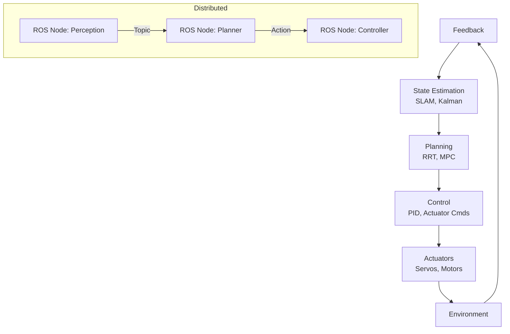

# Robotics Technical Notes
<!-- [A rectangular image illustrating an advanced robotics workflow: an autonomous robot navigating a dynamic environment, with detailed components like “sensors” (e.g., lidar, stereo cameras), “actuators” (e.g., servos, wheels), and a “controller” (e.g., NVIDIA Jetson), integrated with a ROS-based architecture, visualized in a 3D simulation (e.g., Gazebo) on a workstation, displaying metrics for localization accuracy, path efficiency, and real-time performance.] -->

## Quick Reference
- **One-sentence definition**: Robotics is the sophisticated integration of sensing, planning, and actuation to design autonomous systems that operate reliably and efficiently in complex, dynamic environments.
- **Key use cases**: Autonomous navigation in unstructured terrains, real-time manipulation in industrial settings, and multi-robot coordination for large-scale tasks.
- **Prerequisites**: Expertise in control theory, robotic frameworks (e.g., ROS), embedded systems, and proficiency in Python/C++ with real or simulated robots.

## Table of Contents
- [Introduction](#introduction)
- [Core Concepts](#core-concepts)
    - [Fundamental Understanding](#fundamental-understanding)
    - [Visual Architecture](#visual-architecture)
- [Implementation Details](#implementation-details)
    - [Advanced Topics](#advanced-topics)
- [Real-World Applications](#real-world-applications)
    - [Industry Examples](#industry-examples)
    - [Hands-On Project](#hands-on-project)
- [Tools & Resources](#tools--resources)
    - [Essential Tools](#essential-tools)
    - [Learning Resources](#learning-resources)
- [References](#references)
- [Appendix](#appendix)

## Introduction
- **What**: Robotics synthesizes advanced hardware (sensors, actuators) and software (perception, planning, control) to create systems capable of autonomous decision-making and interaction with physical environments.  
- **Why**: It enables scalable automation, precision in critical tasks, and adaptability to uncertainty, addressing challenges in reliability, safety, and efficiency.  
- **Where**: Deployed in autonomous vehicles (e.g., Waymo), surgical robotics (e.g., Da Vinci), and space exploration (e.g., NASA rovers).

## Core Concepts
### Fundamental Understanding
- **Basic Principles**:  
  - Robotics operates on a closed-loop paradigm: perception (state estimation), planning (decision-making), and control (execution) in real time.  
  - Robustness requires sensor fusion, fault-tolerant control, and dynamic replanning under uncertainty.  
  - Scalability leverages distributed architectures and modular designs (e.g., ROS nodes).  
- **Key Components**:  
  - **Perception**: Combines sensors (lidar, cameras, IMUs) for state estimation (e.g., SLAM, odometry).  
  - **Planning**: Generates feasible actions (e.g., A* paths, RRT motion plans) considering constraints.  
  - **Control**: Translates plans into actuator commands (e.g., MPC, PID) with feedback.  
  - **Communication**: Ensures data flow (e.g., ROS topics, DDS in ROS 2) across distributed nodes.  
- **Common Misconceptions**:  
  - *“More compute = better”*: Real-time constraints often favor optimized algorithms over raw power.  
  - *“Autonomy is absolute”*: Most systems integrate human-in-the-loop for safety-critical tasks.

### Visual Architecture

- **System Overview**: Perception informs planning via state estimation, control executes plans, and feedback refines the loop, often distributed via ROS.  
- **Component Relationships**: Estimation feeds planning, control drives actuators, and feedback ensures adaptability.

## Implementation Details

### Advanced Topics [Advanced]
**Language**: Python (using ROS Noetic with SLAM and navigation)  
```
# ROS node for autonomous navigation with SLAM (nav_stack.py)
#!/usr/bin/env python
import rospy
import actionlib
from nav_msgs.msg import Odometry
from sensor_msgs.msg import LaserScan
from geometry_msgs.msg import Twist
from move_base_msgs.msg import MoveBaseAction, MoveBaseGoal
from tf.transformations import quaternion_from_euler

class AutonomousNav:
    def __init__(self):
        # Initialize node
        rospy.init_node('autonomous_nav', anonymous=True)
        # Subscribers
        self.odom_sub = rospy.Subscriber('/odom', Odometry, self.odom_cb)
        self.scan_sub = rospy.Subscriber('/scan', LaserScan, self.scan_cb)
        # Publisher
        self.cmd_pub = rospy.Publisher('/cmd_vel', Twist, queue_size=10)
        # Action client
        self.move_base = actionlib.SimpleActionClient('move_base', MoveBaseAction)
        self.move_base.wait_for_server()
        # State
        self.current_pose = None
        self.obstacle_detected = False

    def odom_cb(self, msg):
        self.current_pose = msg.pose.pose

    def scan_cb(self, msg):
        # Simple obstacle detection
        self.obstacle_detected = min(msg.ranges) < 0.5

    def navigate_to_goal(self, x, y, yaw):
        # Define goal
        goal = MoveBaseGoal()
        goal.target_pose.header.frame_id = "map"
        goal.target_pose.header.stamp = rospy.Time.now()
        goal.target_pose.pose.position.x = x
        goal.target_pose.pose.position.y = y
        q = quaternion_from_euler(0, 0, yaw)
        goal.target_pose.pose.orientation.x = q[0]
        goal.target_pose.pose.orientation.y = q[1]
        goal.target_pose.pose.orientation.z = q[2]
        goal.target_pose.pose.orientation.w = q[3]
        # Send goal
        self.move_base.send_goal(goal)
        self.move_base.wait_for_result()
        return self.move_base.get_state() == actionlib.GoalStatus.SUCCEEDED

    def run(self):
        rate = rospy.Rate(10)  # 10 Hz
        while not rospy.is_shutdown():
            if not self.obstacle_detected:
                # Navigate to example goal (2m forward, 0 deg)
                success = self.navigate_to_goal(2.0, 0.0, 0.0)
                rospy.loginfo(f"Goal reached: {success}")
            else:
                # Emergency stop
                self.cmd_pub.publish(Twist())
                rospy.logwarn("Obstacle detected, stopping")
            rate.sleep()

if __name__ == '__main__':
    try:
        nav = AutonomousNav()
        nav.run()
    except rospy.ROSInterruptException:
        pass
```
- **System Design**:  
  - Integrates ROS Navigation Stack (`move_base`) for SLAM-based path planning.  
  - Combines action clients (goals), topics (sensor data), and emergency control logic.  
- **Optimization Techniques**:  
  - Uses quaternion for robust orientation in 3D space.  
  - Implements obstacle detection to preempt navigation failures.  
- **Production Considerations**:  
  - Fault-tolerant with action status checks and obstacle handling.  
  - Scalable to ROS 2 with DDS for real-time, multi-robot setups (not shown).  
  - Optimized for bandwidth with selective subscriptions.

- **Step-by-Step Setup**:  
  1. Install ROS Noetic on Ubuntu 20.04 (http://wiki.ros.org/noetic/Installation).  
  2. Install Navigation Stack: `sudo apt install ros-noetic-navigation`.  
  3. Create package: `cd ~/catkin_ws/src && catkin_create_pkg robot_nav nav_msgs sensor_msgs geometry_msgs move_base_msgs rospy`.  
  4. Save `nav_stack.py` in `robot_nav/scripts`, make executable: `chmod +x nav_stack.py`.  
  5. Configure `move_base` params (e.g., `costmap_common_params.yaml`, `local_planner_params.yaml`) in `robot_nav/config`.  
  6. Build: `cd ~/catkin_ws && catkin_make`.  
  7. Source: `source devel/setup.bash`.  
  8. Run Gazebo with TurtleBot3: `roslaunch turtlebot3_gazebo turtlebot3_world.launch`.  
  9. Run SLAM: `roslaunch turtlebot3_slam turtlebot3_slam.launch`.  
  10. Run node: `rosrun robot_nav nav_stack.py`.  

## Real-World Applications
### Industry Examples
- **Use Case**: Autonomous forklift (e.g., Toyota Material Handling).  
- **Implementation Pattern**: SLAM with lidar, MPC for control, ROS for integration.  
- **Success Metrics**: Localization error <5cm, cycle time <30s.  

### Hands-On Project
- **Project Goals**: Implement autonomous navigation in a simulated environment.  
- **Implementation Steps**:  
  1. Set up TurtleBot3 in Gazebo with ROS Noetic.  
  2. Build a node using `move_base` for goal-directed navigation.  
  3. Add obstacle detection and recovery logic.  
  4. Test with multiple waypoints.  
- **Validation Methods**: Achieve goal accuracy within 10cm, latency <200ms.

## Tools & Resources
### Essential Tools
- **Development Environment**: Ubuntu 20.04, VS Code with ROS plugin.  
- **Key Frameworks**: ROS Noetic, MoveIt, OpenCV, PCL.  
- **Testing Tools**: Gazebo, `rviz`, `rosbag`, NVIDIA Nsight.  

### Learning Resources
- **Documentation**: ROS Wiki (http://wiki.ros.org), NVIDIA Jetson docs.  
- **Tutorials**: “Advanced Robotics with ROS” on The Construct (https://www.theconstruct.ai).  
- **Community Resources**: Robotics Stack Exchange, ROS Discourse.  

## References
- ROS Navigation Docs: http://wiki.ros.org/navigation  
- “Probabilistic Robotics” (Thrun et al., 2005)  
- “Modern Robotics” (Lynch & Park, 2017)  

## Appendix
- **Glossary**:  
  - *SLAM*: Simultaneous Localization and Mapping.  
  - *MPC*: Model Predictive Control.  
- **Setup Guides**:  
  - TurtleBot3 Setup: `sudo apt install ros-noetic-turtlebot3*`.  
- **Code Templates**: See navigation example above.
