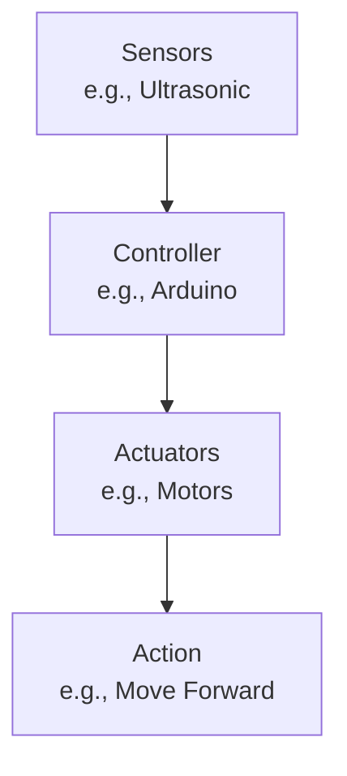

# Robotics Technical Notes
<!-- [A rectangular image showing a simplified robotics workflow: a beginner-friendly diagram with a small wheeled robot, labeled parts like “sensors” (e.g., camera), “actuators” (e.g., motors), and a “controller” (e.g., a microcontroller), connected by arrows showing data flow, displayed on a laptop screen with icons for movement and sensing.] -->

## Quick Reference
- **One-sentence definition**: Robotics is the field of designing, building, and programming machines that sense, think, and act to perform tasks autonomously or semi-autonomously.
- **Key use cases**: Automating tasks like cleaning (e.g., robot vacuums), exploring environments (e.g., Mars rovers), or assisting humans (e.g., robotic arms).
- **Prerequisites**: Curiosity about machines, basic computer skills, no prior programming or engineering experience required.

## Table of Contents
1. [Introduction](#introduction)  
2. [Core Concepts](#core-concepts)  
    - [Fundamental Understanding](#fundamental-understanding)  
    - [Visual Architecture](#visual-architecture)  
3. [Implementation Details](#implementation-details)  
    - [Basic Implementation](#basic-implementation)  
4. [Real-World Applications](#real-world-applications)  
    - [Industry Examples](#industry-examples)  
    - [Hands-On Project](#hands-on-project)  
5. [Tools & Resources](#tools--resources)  
    - [Essential Tools](#essential-tools)  
    - [Learning Resources](#learning-resources)  
6. [References](#references)  
7. [Appendix](#appendix)  

## Introduction
- **What**: Robotics combines engineering and computer science to create machines that can move, sense their surroundings, and make decisions to complete tasks.  
- **Why**: It solves problems by automating repetitive or dangerous jobs, improving efficiency, and enabling new possibilities like exploring space or helping in surgeries.  
- **Where**: Used in homes (e.g., robot lawnmowers), factories (e.g., assembly lines), hospitals (e.g., surgical robots), and research (e.g., AI development).

## Core Concepts
### Fundamental Understanding
- **Basic Principles**:  
  - Robots interact with the world through a cycle: sense (gather data), think (process data), act (move or manipulate).  
  - They rely on hardware (e.g., motors) and software (e.g., code) working together.  
  - Autonomy varies—some robots follow strict instructions, others adapt to changes.  
- **Key Components**:  
  - **Sensors**: Devices that collect data (e.g., cameras for vision, ultrasonic for distance).  
  - **Actuators**: Parts that make the robot move (e.g., motors, servos).  
  - **Controller**: The “brain” that processes sensor data and controls actuators (e.g., Arduino, Raspberry Pi).  
- **Common Misconceptions**:  
  - *“Robots are all like humans”*: Most are simple, like a conveyor belt arm, not sci-fi androids.  
  - *“Robotics is too hard”*: Beginners can start with kits and simple code.

### Visual Architecture

- **System Overview**: Sensors feed data to the controller, which decides actions for the actuators to perform.  
- **Component Relationships**: Sensors inform the controller, which commands actuators to execute tasks.

## Implementation Details
### Basic Implementation [Beginner]
**Language**: Arduino C (for a simple robot with an ultrasonic sensor)  
```cpp
// Simple robot to avoid obstacles using an ultrasonic sensor
#define TRIG_PIN 9    // Trigger pin for ultrasonic sensor
#define ECHO_PIN 10   // Echo pin for ultrasonic sensor
#define MOTOR_LEFT 5  // Left motor PWM pin
#define MOTOR_RIGHT 6 // Right motor PWM pin

void setup() {
  pinMode(TRIG_PIN, OUTPUT);
  pinMode(ECHO_PIN, INPUT);
  pinMode(MOTOR_LEFT, OUTPUT);
  pinMode(MOTOR_RIGHT, OUTPUT);
  Serial.begin(9600); // For debugging
}

void loop() {
  // Measure distance
  digitalWrite(TRIG_PIN, LOW);
  delayMicroseconds(2);
  digitalWrite(TRIG_PIN, HIGH);
  delayMicroseconds(10);
  digitalWrite(TRIG_PIN, LOW);
  long duration = pulseIn(ECHO_PIN, HIGH);
  int distance = duration * 0.034 / 2; // Convert to cm

  // Decide action
  if (distance < 20) { // Obstacle close
    analogWrite(MOTOR_LEFT, 0);   // Stop left
    analogWrite(MOTOR_RIGHT, 0);  // Stop right
    Serial.println("Stop: Obstacle!");
  } else { // Move forward
    analogWrite(MOTOR_LEFT, 100);  // Medium speed
    analogWrite(MOTOR_RIGHT, 100);
    Serial.println("Moving forward");
  }
  delay(100); // Small delay for stability
}
```
- **Step-by-Step Setup**:  
  1. Get an Arduino kit with an ultrasonic sensor (e.g., HC-SR04) and motors (e.g., DC with L298N driver).  
  2. Install Arduino IDE: Download from arduino.cc.  
  3. Connect:  
     - Ultrasonic TRIG to pin 9, ECHO to pin 10, VCC to 5V, GND to GND.  
     - Motors via driver to pins 5 (left), 6 (right), and power.  
  4. Copy code to Arduino IDE, upload to an Arduino Uno.  
  5. Power the robot and place it on a flat surface.  
- **Code Walkthrough**:  
  - `setup()` configures pins for the sensor and motors.  
  - `loop()` measures distance using the ultrasonic sensor.  
  - If distance < 20cm, motors stop; else, they move forward.  
- **Common Pitfalls**:  
  - Loose wiring—double-check connections.  
  - Forgetting `Serial.begin()` if debugging.  
  - Incorrect pin numbers—match your hardware.

## Real-World Applications
### Industry Examples
- **Use Case**: Robot vacuum cleaner (e.g., Roomba).  
- **Implementation Pattern**: Sensors detect walls, actuators drive wheels, controller plans paths.  
- **Success Metrics**: Covers 90%+ of floor area without getting stuck.  

### Hands-On Project
- **Project Goals**: Build a robot that follows a line using sensors.  
- **Implementation Steps**:  
  1. Get an IR sensor (e.g., TCRT5000) and a wheeled robot kit.  
  2. Write Arduino code to read the sensor and adjust motor speeds to stay on a black line.  
  3. Test on a white surface with a black tape path.  
- **Validation Methods**: Ensure the robot follows the line without veering off.

## Tools & Resources
### Essential Tools
- **Development Environment**: Arduino IDE, breadboard, USB cable.  
- **Key Frameworks**: Arduino platform, basic Python for simulation (optional).  
- **Testing Tools**: Multimeter (for wiring checks), Serial Monitor (in Arduino IDE).  

### Learning Resources
- **Documentation**: Arduino Reference (https://www.arduino.cc/reference/en/).  
- **Tutorials**: “Robotics for Beginners” on SparkFun (sparkfun.com) or YouTube.  
- **Community Resources**: Arduino Forum (forum.arduino.cc), r/robotics on Reddit.  

## References
- Arduino Documentation: https://www.arduino.cc/reference/en/  
- “Robotics: A Very Short Introduction” (Winfield, 2012)  
- SparkFun Robotics Tutorials: https://learn.sparkfun.com  

## Appendix
- **Glossary**:  
  - *Sensor*: Device that detects (e.g., light, distance).  
  - *Actuator*: Part that moves (e.g., motor).  
- **Setup Guides**:  
  - Install Arduino IDE: Download from arduino.cc, follow prompts.  
  - Buy kit: Search “Arduino robot kit” (e.g., Elegoo, SunFounder).  
- **Code Templates**: See obstacle avoidance example above.
