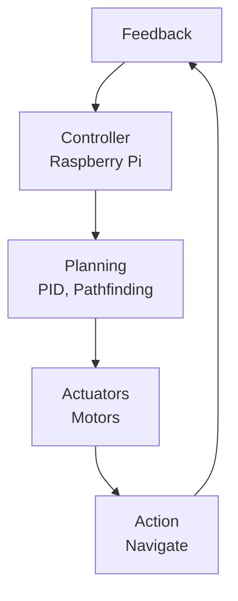

# Robotics Technical Notes
<!-- [A rectangular image depicting an intermediate robotics workflow: a wheeled robot navigating a maze, with labeled components like “sensors” (e.g., lidar, encoders), “actuators” (e.g., DC motors), and a “controller” (e.g., Raspberry Pi), connected by arrows showing data flow for path planning, displayed on a monitor with metrics for navigation accuracy and response time.] -->

## Quick Reference
- **One-sentence definition**: Robotics is the interdisciplinary field of designing and programming machines that integrate sensing, computation, and actuation to perform tasks with increasing autonomy and efficiency.
- **Key use cases**: Autonomous navigation, object manipulation, and human-robot interaction in environments like warehouses or homes.
- **Prerequisites**: Basic experience with microcontrollers (e.g., Arduino), Python or C++ programming, and understanding of robot components (sensors, motors).

## Table of Contents
1. [Introduction](#introduction)  
2. [Core Concepts](#core-concepts)  
    - [Fundamental Understanding](#fundamental-understanding)  
    - [Visual Architecture](#visual-architecture)  
3. [Implementation Details](#implementation-details)  
    - [Intermediate Patterns](#intermediate-patterns)  
4. [Real-World Applications](#real-world-applications)  
    - [Industry Examples](#industry-examples)  
    - [Hands-On Project](#hands-on-project)  
5. [Tools & Resources](#tools--resources)  
    - [Essential Tools](#essential-tools)  
    - [Learning Resources](#learning-resources)  
6. [References](#references)  
7. [Appendix](#appendix)  

## Introduction
- **What**: Robotics combines hardware (sensors, actuators) and software (control algorithms) to create systems that perceive, plan, and act in physical environments.  
- **Why**: It enables automation of complex tasks, enhances precision, and adapts to dynamic settings, addressing challenges in scalability and reliability.  
- **Where**: Applied in logistics (e.g., delivery drones), agriculture (e.g., automated harvesters), and research (e.g., AI-driven exploration).

## Core Concepts
### Fundamental Understanding
- **Basic Principles**:  
  - Robotics operates on a feedback loop: sense (collect data), plan (decide actions), act (execute), and repeat.  
  - Control systems balance open-loop (predefined) and closed-loop (feedback-driven) strategies.  
  - Modularity allows reusable components for perception, planning, and control.  
- **Key Components**:  
  - **Sensors**: Provide environmental data (e.g., lidar for distance, IMU for orientation).  
  - **Actuators**: Enable movement or manipulation (e.g., DC motors, servos, grippers).  
  - **Controller**: Processes data and issues commands (e.g., Raspberry Pi, STM32).  
  - **Planning**: Algorithms for navigation or task execution (e.g., PID control, pathfinding).  
- **Common Misconceptions**:  
  - *“More sensors = better”*: Sensor fusion requires careful integration to avoid noise.  
  - *“Robots are fully autonomous”*: Many rely on human oversight or predefined rules.

### Visual Architecture

- **System Overview**: Sensors feed data to the controller, which plans actions for actuators, creating a feedback loop.  
- **Component Relationships**: Planning interprets sensor data, drives actuators, and adjusts based on outcomes.

## Implementation Details
### Intermediate Patterns [Intermediate]
**Language**: Python (using Raspberry Pi with PWM motor control and PID)  
```python
# Robot navigation with PID control for line following
import RPi.GPIO as GPIO
import time
from adafruit_vl53l0x import VL53L0X
import board
import busio

# Setup
GPIO.setmode(GPIO.BCM)
MOTOR_LEFT = 18   # PWM pin for left motor
MOTOR_RIGHT = 19  # PWM pin for right motor
SENSOR_PIN = 0x29 # I2C address for VL53L0X
GPIO.setup(MOTOR_LEFT, GPIO.OUT)
GPIO.setup(MOTOR_RIGHT, GPIO.OUT)
left_pwm = GPIO.PWM(MOTOR_LEFT, 100)   # 100 Hz
right_pwm = GPIO.PWM(MOTOR_RIGHT, 100)
left_pwm.start(0)
right_pwm.start(0)

# Sensor setup (VL53L0X for distance)
i2c = busio.I2C(board.SCL, board.SDA)
sensor = VL53L0X(i2c)

# PID controller
class PID:
    def __init__(self, kp, ki, kd, setpoint):
        self.kp, self.ki, self.kd = kp, ki, kd
        self.setpoint = setpoint
        self.prev_error = 0
        self.integral = 0

    def update(self, measurement):
        error = self.setpoint - measurement
        self.integral += error
        derivative = error - self.prev_error
        output = self.kp * error + self.ki * self.integral + self.kd * derivative
        self.prev_error = error
        return output

# Main control loop
def control_loop():
    pid = PID(kp=0.5, ki=0.01, kd=0.1, setpoint=10)  # Keep 10cm from wall
    try:
        while True:
            distance = sensor.range / 10.0  # Convert mm to cm
            correction = pid.update(distance)
            base_speed = 50  # Base PWM duty cycle
            left_speed = min(max(base_speed + correction, 0), 100)
            right_speed = min(max(base_speed - correction, 0), 100)
            left_pwm.ChangeDutyCycle(left_speed)
            right_pwm.ChangeDutyCycle(right_speed)
            print(f"Distance: {distance:.1f}cm, Left: {left_speed}, Right: {right_speed}")
            time.sleep(0.1)
    except KeyboardInterrupt:
        left_pwm.stop()
        right_pwm.stop()
        GPIO.cleanup()

if __name__ == "__main__":
    control_loop()
```
- **Design Patterns**:  
  - **PID Control**: Feedback loop adjusts motor speeds to maintain a setpoint (e.g., distance to wall).  
  - **Modular Sensor Integration**: Uses I2C for VL53L0X, adaptable to other sensors.  
- **Best Practices**:  
  - Tune PID constants (`kp`, `ki`, `kd`) empirically for smooth control.  
  - Limit PWM duty cycle (0-100) to protect motors.  
  - Add exception handling for clean shutdown.  
- **Performance Considerations**:  
  - Use high-frequency PWM (100 Hz) for smooth motor response.  
  - Minimize sleep delays (0.1s) to balance responsiveness and CPU usage.  

- **Step-by-Step Setup**:  
  1. Get a Raspberry Pi 4, VL53L0X distance sensor, and DC motors with driver (e.g., L298N).  
  2. Install Raspberry Pi OS (Bullseye): Use Raspberry Pi Imager.  
  3. Enable I2C: `sudo raspi-config`, Interface Options.  
  4. Install libraries: `pip install RPi.GPIO adafruit-circuitpython-vl53l0x`.  
  5. Connect:  
     - VL53L0X to I2C pins (SDA, SCL, 3.3V, GND).  
     - Motors via driver to GPIO 18, 19, and power.  
  6. Save code as `robot_nav.py`, run: `python robot_nav.py`.  
  7. Test on a surface with a wall to follow.  

## Real-World Applications
### Industry Examples
- **Use Case**: Warehouse robot (e.g., Fetch Robotics).  
- **Implementation Pattern**: Lidar and encoders feed a PID-based controller for navigation.  
- **Success Metrics**: Path accuracy within 5cm, obstacle avoidance in <1s.  

### Hands-On Project
- **Project Goals**: Build a wall-following robot with PID control.  
- **Implementation Steps**:  
  1. Assemble a robot with a Raspberry Pi, VL53L0X, and motors.  
  2. Implement PID to maintain 10cm from a wall.  
  3. Test along a straight wall, tweaking `kp`, `ki`, `kd`.  
- **Validation Methods**: Achieve stable distance (±2cm) at moderate speed.

## Tools & Resources
### Essential Tools
- **Development Environment**: Raspberry Pi OS, VS Code.  
- **Key Frameworks**: RPi.GPIO, CircuitPython, ROS (optional intro).  
- **Testing Tools**: Oscilloscope (motor signals), PuTTY (SSH to Pi).  

### Learning Resources
- **Documentation**: Raspberry Pi Docs (https://www.raspberrypi.org/documentation/).  
- **Tutorials**: “PID Control for Robots” on Hackster.io or YouTube.  
- **Community Resources**: r/raspberry_pi, Robotics Stack Exchange.  

## References
- Raspberry Pi GPIO Docs: https://www.raspberrypi.org/documentation/  
- “Introduction to Robotics” (Craig, 2017)  
- Adafruit CircuitPython: https://learn.adafruit.com  

## Appendix
- **Glossary**:  
  - *PID*: Proportional-Integral-Derivative control for feedback.  
  - *I2C*: Protocol for sensor communication.  
- **Setup Guides**:  
  - Flash Pi OS: Use Raspberry Pi Imager from raspberrypi.org.  
- **Code Templates**: See PID example above.