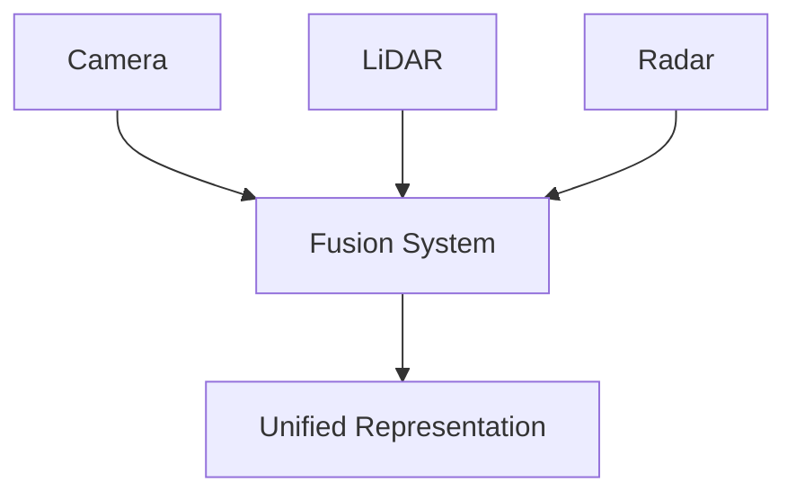

# Multimodal Sensor Fusion Technical Notes
<!-- [Illustration showing multiple sensors (e.g., camera, LiDAR, radar) feeding data into a fusion system, which outputs a unified representation.] -->

## Quick Reference
- One-sentence definition: Multimodal sensor fusion is the process of combining data from multiple sensors to create a more accurate and comprehensive understanding of the environment.
- Key use cases: Autonomous vehicles, robotics, surveillance, and healthcare monitoring.
- Prerequisites:  
  - Intermediate: Familiarity with sensors, data processing, Python, and basic fusion techniques.

## Table of Contents
1. Introduction  
2. Core Concepts  
   - Fundamental Understanding  
   - Visual Architecture  
3. Implementation Details  
   - Intermediate Patterns  
4. Real-World Applications  
   - Industry Examples  
   - Hands-On Project  
5. Tools & Resources  
6. References  
7. Appendix  

---

## Introduction
### What: Core Definition and Purpose
Multimodal sensor fusion is the process of integrating data from multiple sensors (e.g., cameras, LiDAR, radar) to produce a more accurate and comprehensive representation of the environment. This technique is crucial for applications where a single sensor type is insufficient to capture all necessary information.

### Why: Problem It Solves/Value Proposition
Multimodal sensor fusion addresses the limitations of individual sensors by combining their strengths and compensating for their weaknesses. This leads to improved accuracy, reliability, and robustness in perception systems.

### Where: Application Domains
Multimodal sensor fusion is widely used in:
- Autonomous Vehicles: Combining camera, LiDAR, and radar data for object detection and navigation.
- Robotics: Enhancing perception and decision-making in robots.
- Surveillance: Integrating video, audio, and motion sensors for security monitoring.
- Healthcare Monitoring: Combining data from various medical sensors for patient monitoring.

---

## Core Concepts
### Fundamental Understanding
- **Basic Principles**:  
  - Sensor Types: Different sensors (e.g., cameras, LiDAR, radar) capture different types of data.  
  - Data Fusion: Combining data from multiple sensors to create a unified representation.  
  - Fusion Levels: Data can be fused at different levels, such as raw data, feature, or decision level.  

- **Key Components**:  
  - Sensors: Devices that capture data from the environment.  
  - Fusion Algorithms: Techniques for combining sensor data (e.g., Kalman filter, Bayesian inference).  
  - Unified Representation: A comprehensive model of the environment created from fused data.  

- **Common Misconceptions**:  
  - More sensors always improve performance: Proper fusion and calibration are crucial for effective integration.  
  - Fusion is only for advanced systems: Intermediate fusion techniques can be implemented with moderate resources.  

### Visual Architecture


---

## Implementation Details
### Intermediate Patterns [Intermediate]
```python
import numpy as np
from scipy.stats import multivariate_normal

# Simulate sensor data
camera_data = np.array([1.0, 2.0, 3.0])  # Example camera data
lidar_data = np.array([1.1, 2.1, 3.1])   # Example LiDAR data
radar_data = np.array([1.2, 2.2, 3.2])   # Example radar data

# Define covariance matrices for sensor uncertainties
camera_cov = np.eye(3) * 0.1
lidar_cov = np.eye(3) * 0.05
radar_cov = np.eye(3) * 0.2

# Create multivariate normal distributions for each sensor
camera_dist = multivariate_normal(mean=camera_data, cov=camera_cov)
lidar_dist = multivariate_normal(mean=lidar_data, cov=lidar_cov)
radar_dist = multivariate_normal(mean=radar_data, cov=radar_cov)

# Fuse data using Bayesian inference
fused_mean = np.linalg.inv(np.linalg.inv(camera_cov) + np.linalg.inv(lidar_cov) + np.linalg.inv(radar_cov)) @ (
    np.linalg.inv(camera_cov) @ camera_data + np.linalg.inv(lidar_cov) @ lidar_data + np.linalg.inv(radar_cov) @ radar_data)
fused_cov = np.linalg.inv(np.linalg.inv(camera_cov) + np.linalg.inv(lidar_cov) + np.linalg.inv(radar_cov))

print("Fused Mean:", fused_mean)
print("Fused Covariance:", fused_cov)
```

- **Design Patterns**:  
  - Bayesian Inference: Use probabilistic models to fuse sensor data.  
  - Covariance Matrices: Represent sensor uncertainties and their impact on fusion.  

- **Best Practices**:  
  - Use appropriate probabilistic models for sensor fusion.  
  - Implement robust error handling and logging for accurate fusion.  

- **Performance Considerations**:  
  - Optimize matrix operations for efficient computation.  
  - Use efficient data structures to handle large datasets.  

---

## Real-World Applications
### Industry Examples
- **Autonomous Vehicles**: Combining camera, LiDAR, and radar data for object detection and navigation.  
- **Robotics**: Enhancing perception and decision-making in robots.  
- **Surveillance**: Integrating video, audio, and motion sensors for security monitoring.  
- **Healthcare Monitoring**: Combining data from various medical sensors for patient monitoring.  

### Hands-On Project
- **Project Goals**: Build a sensor fusion system to combine data from simulated sensors using Bayesian inference.  
- **Implementation Steps**:  
  1. Simulate data from multiple sensors (e.g., camera, LiDAR, radar).  
  2. Define covariance matrices to represent sensor uncertainties.  
  3. Implement Bayesian inference to fuse the sensor data.  
  4. Output and visualize the fused data.  
- **Validation Methods**: Compare the fused data with individual sensor data to verify accuracy.  

---

## Tools & Resources
### Essential Tools
- **Development Environment**: Python, Jupyter Notebook.  
- **Key Frameworks**: NumPy, SciPy, OpenCV.  
- **Testing Tools**: pytest, unittest.  

### Learning Resources
- **Documentation**: [NumPy Documentation](https://numpy.org/doc/), [SciPy Documentation](https://docs.scipy.org/doc/scipy/).  
- **Tutorials**: "Introduction to Sensor Fusion" by Medium.  
- **Community Resources**: Stack Overflow, GitHub repositories.  

---

## References
- Official documentation: [NumPy Documentation](https://numpy.org/doc/), [SciPy Documentation](https://docs.scipy.org/doc/scipy/).  
- Technical papers: "Multisensor Data Fusion: A Review of the State-of-the-Art" by Hall and Llinas.  
- Industry standards: Sensor fusion applications in autonomous vehicles and robotics.  

---

## Appendix
### Glossary
- **Sensor**: A device that detects and responds to inputs from the environment.  
- **Data Fusion**: The process of combining data from multiple sources to produce a unified representation.  
- **Fusion Algorithm**: A technique used to combine data from multiple sensors.  

### Setup Guides
- Install NumPy: `pip install numpy`.  
- Install SciPy: `pip install scipy`.  

### Code Templates
- Intermediate sensor fusion template available on GitHub.  
