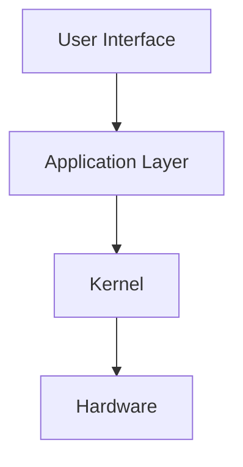

# Operating System (OS) - Notes

## Table of Contents

  - [Introduction](#introduction)
    - [What is an operating system?](#what-is-an-operating-system)
    - [Applications](#applications)
  - [Fundamentals](#fundamentals)
    - [How operating system works?](#how-operating-system-works)
      - [Operating System Architecture](#operating-system-architecture)
  - [Tools \& Frameworks](#tools--frameworks)
  - [Hello World!](#hello-world)
  - [Lab: Zero to Hero Projects](#lab-zero-to-hero-projects)
  - [References](#references)


## Introduction
An operating system (OS) is a software that manages the hardware and software resources of a computer and provides common services for other programs.

### What is an operating system?
An operating system is a program that acts as an intermediary between the user and the computer hardware. It controls the execution of applications, the allocation of memory, the input and output of devices, the communication with networks, and the security of the system. ¹

### Applications
Operating systems are essential for any computer or computer-like device, such as laptops, tablets, smartphones, smartwatches, routers, servers, and supercomputers. Different types of operating systems are designed for different purposes and platforms, such as Windows, macOS, Linux, Android, iOS, Chrome OS, etc. ¹²

## Fundamentals

### Operating System Architecture
The main components and functions of an operating system are:



### How operating system works?
- An operating system consists of a kernel and a user interface. 
- The kernel is the core of the operating system that interacts with the hardware and provides low-level services to the user programs. 
- The user interface is the part of the operating system that allows the user to interact with the system, either through a graphical user interface (GUI) or a command-line interface (CLI).


## Tools & Frameworks
Some tools and frameworks that are used to develop, test, and debug operating systems are:

- **QEMU**: A cross-platform emulator and virtualizer that can run various operating systems on different hardware architectures. 
- **Bochs**: An open-source emulator that can run x86 and x86-64 operating systems on various platforms. 
- **GDB**: A powerful debugger that can be used to examine and modify the state of a running program, such as an operating system. 
- **LLVM**: A collection of modular and reusable compiler and toolchain technologies that can be used to optimize and generate code for various operating systems and architectures. 

## Hello World!
Here is a simple "Hello World!" program written in C that can run on most operating systems:

```c
#include <stdio.h>

int main(void) {
    printf("Hello World!\n");
    return 0;
}
```

## Lab: Zero to Hero Projects
Some projects that can help you learn more about operating systems and practice your skills are:

- **Write your own operating system**: A challenging but rewarding project that will teach you the basics of operating system development, such as booting, memory management, interrupts, system calls, etc. You can follow this tutorial to get started: 
- **Modify an existing operating system**: A more accessible project that will let you explore and modify the source code of an existing operating system, such as Linux, FreeBSD, or Minix. You can add new features, fix bugs, or improve performance. You can find the source code and documentation of these operating systems online:   
- **Port an operating system to a new platform**: A challenging but fun project that will require you to adapt an operating system to run on a different hardware architecture, such as ARM, MIPS, or RISC-V. You will need to understand the differences and similarities between the architectures and how to write assembly code and device drivers for them. You can find some examples of porting projects here:   

## References

- (1) Operating system - Wikipedia. https://en.wikipedia.org/wiki/Operating_system.
- (2) Operating System (OS) Definition & Examples - Lifewire. https://www.lifewire.com/operating-systems-2625912.
- (3) Operating System Tutorial - GeeksforGeeks. https://www.geeksforgeeks.org/operating-systems/.
- (4) en.wikipedia.org. https://en.wikipedia.org/wiki/Operating_system.
