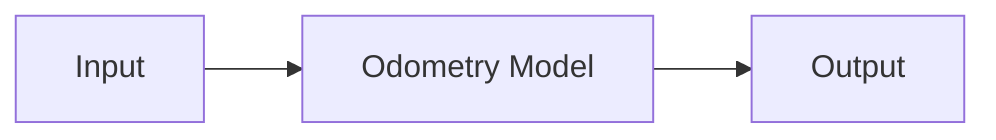
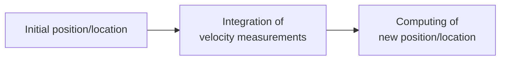

# Odemetry - Notes 

## What is Odometry ?

Estimates the robot position relative to a starting location.


##### [Odometry of a robot; the distance traveled by each of the wheels is identical, but the final positions are different.](#)

### How it works ? 





```
  where : 
    - Initial position/location : O(x_0, y_0, theta_0), center coordinates
    - New position/location : O(x, y, theta), position and orientation
```
## Kinematic Model


- Allows describe the movement of the robot
- calculate the global movement of the robot from the odometric measurements
- the robot movement is controlled by the speed/velocity differential btw two drive wheels.

Where : 

- $d_{l}$ , $d_{r}$ : the respective movements of the left and right wheels
- $v_{l}, v_{r}$ : the respective speeds of the left and right wheels
- $x, y, \theta$ : the coordinates of the robot (position and orientation)
- $d$  : the movement of the robot
- $v$ : the speed of the robot
- $e$ : the gap between the two wheels;
- ${\displaystyle x_{O}}, {\displaystyle y_{O}}$ and $R$ : center coordinates $O$ of the trajectory circle and its radius. 


### Direct Model
- If we assume that the trajectory of the robot is a circle of radius
$R$ traveled at angular rate $\omega = {\displaystyle \textstyle {\frac {\mathrm {d} \theta }{\mathrm {d} t}}} ( R > 0$,  if the circle is traversed counterclockwise), then we have:

${\displaystyle v=R\;{\frac {\mathrm {d} \theta }{\mathrm {d} t}}}$

then wheel speeds : 

${\displaystyle \left\{{\begin{matrix}v_{g}&=&\displaystyle (R-{\frac {e}{2}})\;{\frac {\mathrm {d} \theta } {\mathrm {d} t}}&=&\displaystyle (R-{\frac {e}{2}}){\frac {v}{R}}\\v_{d}&=&\displaystyle ( R+{\frac {e}{2}})\;{\frac {\mathrm {d} \theta }{\mathrm {d} t}}&=&\displaystyle (R+{\frac {e}{2 }}){\frac {v}{R}}\end{matrix}}\right.}$


### Inverse Model

- The inversion of the previous system gives:

$\left\{{\begin{matrix}v&=&\displaystyle {\frac {v_{g}+v_{d}}{2}}\\R&=&\displaystyle {\frac {e}{2}} \,{\frac {v_{d}+v_{g}}{v_{d}-v_{g}}}\end{matrix}}\right.$

### Calculation of Odemetry

${\displaystyle \mathrm {d} \theta={\frac {d}{R}}}$

${\displaystyle \left\{{\begin{matrix}x_{O}&=&x-R\,\cos(\theta -{\frac {\pi }{2}})\\y_{O}&= &y-R\,\sin(\theta -{\frac {\pi }{2}})\end{matrix}}\right.}$

Update the position of the robot : 

${\displaystyle \left\{{\begin{matrix}\theta &\leftarrow &\theta +\mathrm {d} \theta \\x&\leftarrow &x_{O}+R\,\cos(\theta -{\ frac {\pi }{2}})\\y&\leftarrow &y_{O}+R\,\sin(\theta -{\frac {\pi }{2}})\end{matrix}}\right. }$

## Applications
- Robotics
- Self-Driving Cars
- Trains
- ...
## Tools & frameworks

# References 
- en :
  - Odometry :
    - https://en.wikipedia.org/wiki/Odometry
  - Differential wheeled robot :
    - https://en.wikipedia.org/wiki/Differential_wheeled_robot
  - Robo-Rats Locomotion Page: 
    - https://groups.csail.mit.edu/drl/courses/cs54-2001s/locomotion.html

- fr 
  - wiki : 
    - https://fr.wikipedia.org/wiki/Odom%C3%A9trie
    - https://fr.wikipedia.org/wiki/Portail:Robotique
    - 
  
  - Positionnement du robot (OLIVIER COCHELIN (COCO) : 
    - http://manubatbat.free.fr/doc/positionning/Positionning.html
  - http://manubatbat.free.fr/doc/positionning/node5.html
