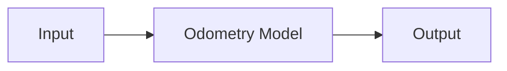
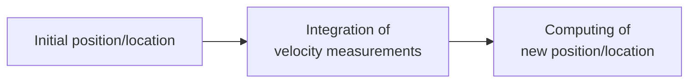

# Odemetry - Notes 

**Table Of Contents**

- [What is Odometry ?](#what-is-odometry-)
  - [How it works ?](#how-it-works-)
- [Kinematic Model](#kinematic-model)
  - [Direct Model](#direct-model)
  - [Inverse Model](#inverse-model)
  - [Calculation of Odometry](#calculation-of-odometry)
- [Applications](#applications)
  - [Example of Model Implementation in C language](#example-of-model-implementation-in-c-language)
- [Tools \& frameworks](#tools--frameworks)
- [References](#references)

## What is Odometry ?

Estimates the robot position relative to a starting location.


##### [Odometry of a robot - the distance traveled by each of the wheels is identical, but the final positions are different.](#)

### How it works ? 





```
  where : 
    - Initial position/location : O(x_0, y_0, theta_0), center coordinates
    - New position/location : O(x, y, theta), position and orientation
```
## Kinematic Model


- Allows describe the movement of the robot
- calculate the global movement of the robot from the odometric measurements
- the robot movement is controlled by the speed/velocity differential btw two drive wheels.

Where : 

- $d_{l}$ , $d_{r}$ : the respective movements of the left and right wheels
- $v_{l}, v_{r}$ : the respective speeds of the left and right wheels
- $x, y, \theta$ : the coordinates of the robot (position and orientation)
- $d$  : the movement of the robot
- $v$ : the speed of the robot
- $e$ : the gap between the two wheels;
- ${\displaystyle x_{0}}, {\displaystyle y_{0}}$ and $R$ : center coordinates $O$ of the trajectory circle and its radius. 


### Direct Model
If we assume that the trajectory of the robot is a circle of radius
$R$ traveled at angular rate $\omega$ :

$\omega = \frac {\mathrm {d} \theta }{\mathrm {d} t}$ ($R > 0$,  if the circle is traversed counterclockwise) 

Notice :  $v = R\omega$ , then we have:

$\displaystyle v=R{\frac {\mathrm {d} \theta }{\mathrm {d} t}}$

then wheel speeds : 

>$\displaystyle \begin{matrix} v_{l}&=&\displaystyle (R-{\frac {e}{2}})\;{\frac {\mathrm {d} \theta } {\mathrm {d} t}}&=&\displaystyle (R-{\frac {e}{2}}){\frac {v}{R}} \\v_{r}&=&\displaystyle ( R+{\frac {e}{2}})\;{\frac {\mathrm {d} \theta }{\mathrm {d} t}}&=&\displaystyle (R+{\frac {e}{2 }}){\frac {v}{R}}\end{matrix}$


### Inverse Model

- The inversion of the previous system gives:

>$\displaystyle \begin{matrix}v&=&\displaystyle {\frac {v_{l}+v_{r}}{2}}\\R&=&\displaystyle {\frac {e}{2}} \,{\frac {v_{r}+v_{l}}{v_{r}-v_{l}}}\end{matrix}$

### Calculation of Odometry

>$\displaystyle \mathrm {d} \theta={\frac {d}{R}}$

>$\displaystyle \begin{matrix}x_{O}&=&x-R\,\cos(\theta -{\frac {\pi }{2}})\\y_{O}&= &y-R\,\sin(\theta -{\frac {\pi }{2}})\end{matrix}$

Update the position of the robot : 

>$\displaystyle \begin{matrix}\theta &\leftarrow &\theta +\mathrm {d} \theta \\x&\leftarrow &x_{O}+R\,\cos(\theta -{\ frac {\pi }{2}})\\y&\leftarrow &y_{O}+R\,\sin(\theta -{\frac {\pi }{2}})\end{matrix}$

## Applications
- Robotics
- Self-Driving Cars
- Trains
- ...

### Example of Model Implementation in C language 

- Position

```c
printf("the new position is : x=%d m and y=%d m\n", x, y);
```
- Orientation
```c
printf("the new orientation is : Theta=%d degree\n", theta);
```
@TODO

## Tools & frameworks

- [kitti](https://www.cvlibs.net/datasets/kitti/eval_odometry.php)
- [OdoViz: A 3D Odometry Visualization and Processing Tool](https://arxiv.org/pdf/2107.07557.pdf)
  
# References 
en :
- Odometry :
  - https://en.wikipedia.org/wiki/Odometry
- Differential wheeled robot :
  - https://en.wikipedia.org/wiki/Differential_wheeled_robot
- Robo-Rats Locomotion Page: 
  - https://groups.csail.mit.edu/drl/courses/cs54-2001s/locomotion.html

fr 
- wiki : 
  - https://fr.wikipedia.org/wiki/Odom%C3%A9trie
  - https://fr.wikipedia.org/wiki/Portail:Robotique
  - 

- Positionnement du robot (OLIVIER COCHELIN (COCO) : 
  - http://manubatbat.free.fr/doc/positionning/Positionning.html
- http://manubatbat.free.fr/doc/positionning/node5.html

Additional reading and tools

- https://en.wikipedia.org/wiki/Classical_mechanics
- https://en.wikipedia.org/wiki/Kinematics
- https://en.wikipedia.org/wiki/Rotation_around_a_fixed_axis
- https://en.wikipedia.org/wiki/Coordinate_system
- https://en.wikipedia.org/wiki/Control_engineering
- https://en.wikipedia.org/wiki/Dynamical_system
- https://en.wikipedia.org/wiki/Algebra
- https://en.wikipedia.org/wiki/Mathematical_analysis
- https://en.wikipedia.org/wiki/Trigonometry